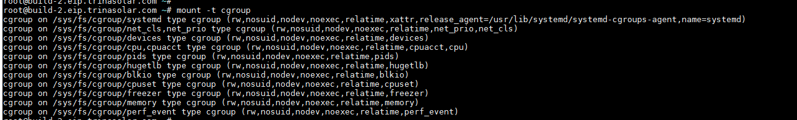
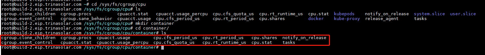
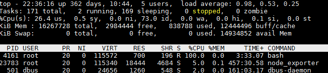
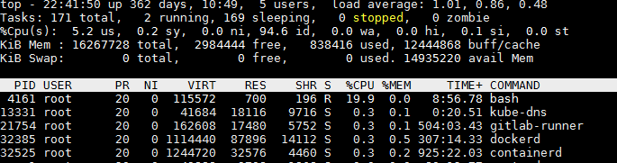
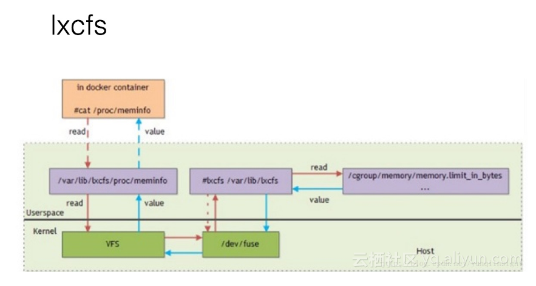

# 资源限制（linux的Cgroups技术）  
Linux Cgroups全程：Linux Control Group，主要作用就是限制一个进程组能够使用的资源上线，包括CPU，内存，磁盘，网络带宽等。  

Cgroups暴露给用户的是在/sys/fs/cgroup路径下的文件系统。
mount -t cgroup可以查看。
  
可以看到它由cpuset，spu，memory等子系统构成。

## 如何使用
### 我们以限制CPU资源举例：
首先进入/sys/fs/cgroup/cpu目录，创建container文件夹，你会发现系统自动生成对应的资源限制文件。  
  

然后我们执行如下脚本：
```shell
while : ; do : ; done &
```
执行后这个进程的PID=4161，然后用top命令查看CPU打到了100%
  

然后我们把这个进程的PID（4161）写入container组的tasks文件
```shell
echo 4161 > /sys/fs/cgroup/cpu/container/tasks 
```
然后我们把container组的cpu限制在20%，做法是向cpu.cfs_quota_us文件写入20000，也就是cpu.cfs_period_us文件数值的20%
```shell
echo 20000 > /sys/fs/cgroup/cpu/container/cpu.cfs_quota_us
```
然后我们在用top命令查看，发现该进程的CPU占用已经被限制在20%
  

刚才这样的限制对应到docker就是
```shell
docker run -it --cpu-period=100000 --cpu-quota=20000 ubuntu /bin/bash
```
这就是docker利用Cgroup来做资源的限制。  
除了CPU子系统，Cgroups还可以限制blkio（设备io），memory（内存），cpuset（cpu核心）  


## LXCFS
/proc目录下记录的是linux内核的运行状态如CPU，内存占用等，top命令就是通过查看这些数据显示系统信息的。  
对于proc文件系统来说并不知道cgroups对容器做了资源限制，所以在容器内用top命令查看，和宿主机中是一样的。
lxcfs就是解决这个问题的。
lxcfs会把宿主机的/var/lib/lxcfs/proc/meminfo文件挂载到docker容器的/proc/meminfo，容器中的top命令就会读取这个目录下的内容，
然后LXCFS的FUSE会实现从容器对应的Cgroup中读取正确的内存限制，从而使容器内的应用获取正确的资源约束设定。  

网络盗图：
  
