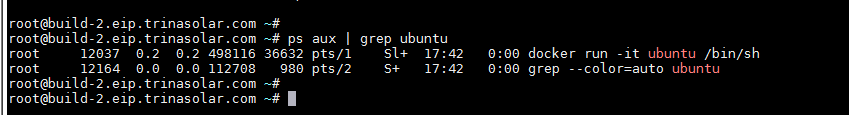
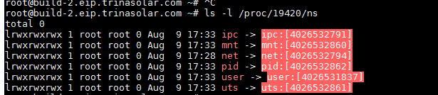

# 容器的隔离（linux的namespace技术）  

## 看一下PID namespace的隔离效果
运行一个最简单的容器：  

  

  
容器内部的sh进程号PID=1 而在宿主机上PID=12037，这就是PID namespace的隔离效果。
## 如何实现？
linux中创建进程：
```C
int pid = clone(main_function, stack_size, SIGCHLD, NULL); 
```
这就是创建一个普通的进程，并且返回一个pid，而PID namespace就是在clone函数中加一个CLINE_NEWPID参数。例如：
```C
int pid = clone(main_function, stack_size, CLONE_NEWPID | SIGCHLD, NULL); 

```
这时候返回的PID=1，而在宿主机上你也可以找到这个进程号，比如180，但是在我们创建出来的进程里是看不到宿主机进程的，它只能看到自己并且PID=1.

### setns()函数
docker exec命令就是使用setns()函数，使新进程加入已经存在的namespace中。

如下命令可以看到docker容器在宿主机上的进程号：
```shell
docker inspect --format '{{ .State.Pid }}' be5a39df042a
19420
```
然后可以在/proc文件系统中找这个进程对应的每种namespace文件。

  

set_ns.c小程序来进入某个namespace：
```C
#define _GNU_SOURCE
#include <fcntl.h>
#include <sched.h>
#include <unistd.h>
#include <stdlib.h>
#include <stdio.h>

#define errExit(msg) do { perror(msg); exit(EXIT_FAILURE);} while (0)

int main(int argc, char *argv[]) {
    int fd;
    
    fd = open(argv[1], O_RDONLY);
    if (setns(fd, 0) == -1) {
        errExit("setns");
    }
    execvp(argv[2], &argv[2]); 
    errExit("execvp");
}

```
argv[1]：上面查到到的具体某个namespace的文件路径  
argv[2]：要在这里namespace中运行的进程
```C
gcc -o set_ns set_ns.c 
$ ./set_ns /proc/19420/ns/net /bin/bash 
$ ifconfig
eth0      Link encap:Ethernet  HWaddr 02:42:ac:11:00:02  
          inet addr:172.17.0.2  Bcast:0.0.0.0  Mask:255.255.0.0
          inet6 addr: fe80::42:acff:fe11:2/64 Scope:Link
          UP BROADCAST RUNNING MULTICAST  MTU:1500  Metric:1
          RX packets:12 errors:0 dropped:0 overruns:0 frame:0
          TX packets:10 errors:0 dropped:0 overruns:0 carrier:0
	   collisions:0 txqueuelen:0 
          RX bytes:976 (976.0 B)  TX bytes:796 (796.0 B)

lo        Link encap:Local Loopback  
          inet addr:127.0.0.1  Mask:255.0.0.0
          inet6 addr: ::1/128 Scope:Host
          UP LOOPBACK RUNNING  MTU:65536  Metric:1
          RX packets:0 errors:0 dropped:0 overruns:0 frame:0
          TX packets:0 errors:0 dropped:0 overruns:0 carrier:0
	  collisions:0 txqueuelen:1000 
          RX bytes:0 (0.0 B)  TX bytes:0 (0.0 B)
```
上面就是容器内的网卡数量，和宿主机完全不一样。

docker也提供了加入另一个容器Network Namespace的命令，-net：
```shell
docker run -it --net container:4ddf4638572d busybox ifconfig
```
当然我们也可以指定-net=host和宿主机共用网络，也就是不适用Network namespace隔离。

## 其他的namespace：
Mount namespace：挂载点隔离

UTS namespace：hostname隔离

IPC namespace：信号量，消息队列等的隔离

Network namespace：网络设备&配置隔离

User namespace：用户和用户组隔离

### 所以docker的隔离并不是自己实现的，而且利用linux内核的namespace技术，所以在使用docker 的时候linux内核本身需要支持namespace，所以需要比较新的内核版本比如，3.8以后。或者4.6（Cgroup）以后。