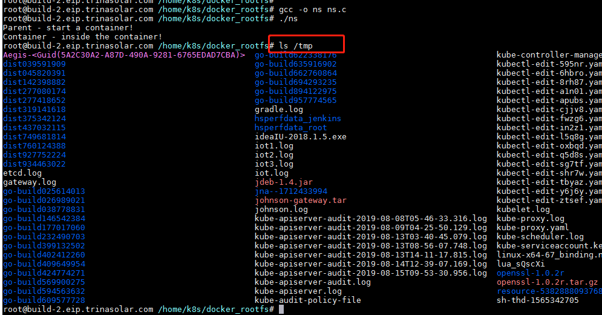
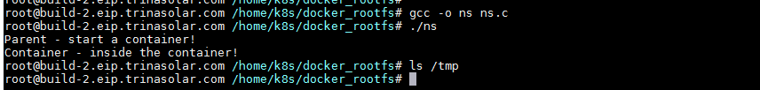
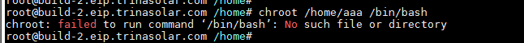
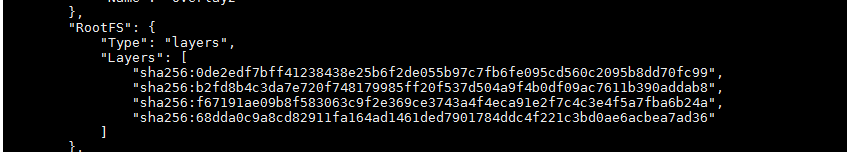
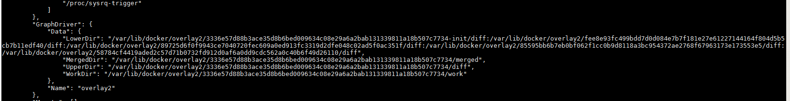
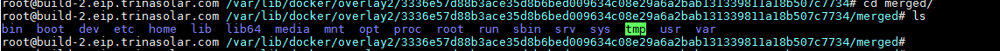

# rootfs（容器镜像）
容器的隔离namespace和容器资源限制cgroup其实都是linux内核本身具备的能力，docker以外的cloudfoundry等等都在使用这项技术，
而正真属于docker的发明就是容器镜像，它打包了整个linux的文件系统，使容器真正具备了Build onec Run anywhere的能力。  
linux rootfs其实并不包括操作系统内核，内核是开机时被加载入内存的，这也是容器的隔离性没有VM好的原因，
因为所有容器共用linux的内核，而且windows系统也没办法跑linux容器。

## Mount Namespace与挂载点
```cgo
#define _GNU_SOURCE
#include <sys/mount.h> 
#include <sys/types.h>
#include <sys/wait.h>
#include <stdio.h>
#include <sched.h>
#include <signal.h>
#include <unistd.h>
#define STACK_SIZE (1024 * 1024)
static char container_stack[STACK_SIZE];
char* const container_args[] = {
  "/bin/bash",
  NULL
};

int container_main(void* arg)
{  
  printf("Container - inside the container!\n");
  execv(container_args[0], container_args);
  printf("Something's wrong!\n");
  return 1;
}

int main()
{
  printf("Parent - start a container!\n");
  int container_pid = clone(container_main, container_stack+STACK_SIZE, CLONE_NEWNS | SIGCHLD , NULL);
  waitpid(container_pid, NULL, 0);
  printf("Parent - container stopped!\n");
  return 0;
}
```
网上的这段程序，就是clone一个新进程，并启用了Mount Namespace，然后在进程中运行/bin/bash，
所以运行这个程序我们的shell就在这个被Mount Namespace隔离的进程中了。  
进入这个进程，然后查看文件系统，比如/tmp，他和宿主机是一样的。。。。。  
其实是Mount Namespace隔离的是挂载点，只有隔离后产生的挂载点是被隔离的，而之前都是继承宿主机的挂载点也就是rootfs。  
 

那么我们在运行/bin/bash之前把/tmp目录挂载成tmpfs文件系统，这样/tmp目录就会被隔离了。  
```cgo
int container_main(void* arg)
{  
  printf("Container - inside the container!\n");
  //追加挂载点
  mount("none", "/tmp", "tmpfs", 0, "");
  execv(container_args[0], container_args);
  printf("Something's wrong!\n");
  return 1;
}
```
 
这样/tmp目录和宿主机就隔离了。

## chroot
在linux中有一个命令chroot可以把整个进程的根目录替换掉。  
比如我们在空的/home/aaa运行：
```shell
chroot /home/aaa /bin/bash
```
   
因为chroot改变了根目录为/home/aaa 而/home/aaa下面没有/bin/bash所有就找不到文件了。  
docker就是利用chroot改变rootfs，比如给容器挂载一个Ubuntu的文件系统，这样容器内的整个文件系统和宿主机就完全隔离了，
然后把这个rootfs打包成image，这样就实现应用打包的一致性问题。

## Union File System
docker为了image的方便重复利用，减少image磁盘占用空间，使用了联合文件系统的技术。  
docker一般使用Aufs或者overlay2来实现UnionFs。  

比如我们运行： docker inspect ubuntu:16.04会发现它的layers由很多层组成。  
   

它会把"LowerDir"里面的所有文件夹一起挂载到"MergedDir"这个目录里。  
   
"MergedDir" 目录就是一个完整的ubuntu系统   
   

docker的rootfs主要由只读层，Init层，读写层组成。

#### 只读层
"LowerDir"里面init以外的层，他们是不可修改的，以增量的形式挂载一起提供只读操作。  

#### init层
专门存放/etc/host,etc/resolv.conf等临时初始化文件，不会被docker commit提交。
因为每个容器启动后可能都会有不同的host等信息，所以docker用单独一层存放它们。  

#### 读写层
在没有操作的时候这一层是空的，而当有写操作是会在这一层新建文件，或者把读层的文件拷贝过来然后提供写修改（copy on write）
而删除操作的话会产生一个.wh.${filename}的文件，这样联合挂载后底层的${filename}对挂载目录就不可见了。  

这样docker的image就不会产生覆盖，而是一层层叠加的，假如现在有两个ubuntu镜像一个是1.6G 一个是1.7G因为底层的共用，
它们在host上占用的磁盘可能就1.7G。  
而且一个镜像被发布了，它具有唯一ID，无论你在哪里下载到这个ID的镜像它都是完全一致的。


