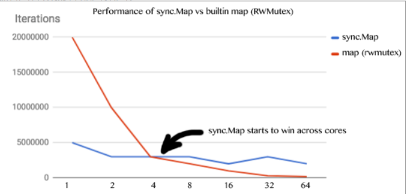

# map的实现

Go的map底层使用hashmap实现的，由hash值mod当前hash表大小查找hash桶的位置。  
hash冲突是通过tophash的数组+overflow链表来存储的。BUCKETSIZE=8，也就是每个bucket存放8个key/value对，超出后申请新的bucket通过overflow形成链。  
bucket内部的查找是通过hash值的高8位存储在tophash中然后通过比较查找到位置，然后比较data中的key如果一样则找到对应的值，否则查找overflow bucket。  
这里面通过hash高位来比较可以加快比较，定位到key之后再进行key的比较。  
当hash冲突过多的时候通过扩容hashmap的大小来降低hash冲突提高查找性能。  
```go
struct Hmap
{
	uint8   B;	// 可以容纳2^B个项
	uint16  bucketsize;   // 每个桶的大小

	byte    *buckets;     // 2^B个Buckets的数组
	byte    *oldbuckets;  // 前一个buckets，只有当正在扩容时才不为空
};
```
```go
struct Bucket
{
	uint8  tophash[BUCKETSIZE]; // hash值的高8位....低位从bucket的array定位到bucket
	Bucket *overflow;           // 溢出桶链表，如果有
	byte   data[1];             // BUCKETSIZE keys followed by BUCKETSIZE values
};
```

hash key查找过程  
```go
do { //对每个桶b
	//依次比较桶内的每一项存放的tophash与所求的hash值高位是否相等
	for(i = 0, k = b->data, v = k + h->keysize * BUCKETSIZE; i < BUCKETSIZE; i++, k += h->keysize, v += h->valuesize) {
		if(b->tophash[i] == top) { 
			k2 = IK(h, k);
			t->key->alg->equal(&eq, t->key->size, key, k2);
			if(eq) { //相等的情况下再去做key比较...
				*keyp = k2;
				return IV(h, v);
			}
		}
	}
	b = b->overflow; //b设置为它的下一下溢出链
} while(b != nil);
```

# sync.map实现
golang的map并不是并发安全的，在使用的时候可以用sync.RWMutex来实现map使用的并发安全性。  
不过这种加锁的方式效率并不高，golang为我们实现个效率更高更稳定的sync.map。  
网上有一副性能对比图：  
  
可以看到随着cpu核数的增加，sync.RWMutex这种方式性能损耗非常快。  

## sync.Map源码解析
sync.map的实现主要利用了atomic.value+Mutex方式实现map的并发安全。原子操作是基于硬件的不会被中断所以性能非常高。  
```go
  type Map struct {
    // 该锁用来保护dirty
    mu Mutex
    // 存读的数据，因为是atomic.value类型，只读类型，所以它的读是并发安全的。  当read中存在key的时候是直接写read
    read atomic.Value
    //包含最新的写入的数据，并且在写的时候，会把read 中未被删除的数据拷贝到该dirty中，因为是普通的map存在并发安全问题，需要用到上面的mu字段。
    dirty map[interface{}]*entry
    // 从read读数据的时候，会将该字段+1，当等于len（dirty）的时候，会将dirty拷贝到read中（从而提升读的性能）。
    misses int
}
```

```go
type readOnly struct {
    m  map[interface{}]*entry
    // 如果Map.dirty的数据和m 中的数据不一样是为true
    amended bool 
}
```

```go
type entry struct {
    //value是个指针类型，虽然read和dirty存在冗余情况，但是由于是指针类型，存储的空间应该不是问题
    p unsafe.Pointer // *interface{}
}
```

### Load
这里有个双重检查，如果read中读到数据就直接返回，如果读不到则上锁再次判断read中是否有值，如果没有的话就从dirty中读取数据。不管dirty有无数据misses++，再判断是否需要上升dirty为read。  
```go
func (m *Map) Load(key interface{}) (value interface{}, ok bool) {
	read, _ := m.read.Load().(readOnly)
	e, ok := read.m[key]
	if !ok && read.amended {
		m.mu.Lock()
		// Avoid reporting a spurious miss if m.dirty got promoted while we were
		// blocked on m.mu. (If further loads of the same key will not miss, it's
		// not worth copying the dirty map for this key.)
		read, _ = m.read.Load().(readOnly)
		e, ok = read.m[key]
		if !ok && read.amended {
			e, ok = m.dirty[key]
			// Regardless of whether the entry was present, record a miss: this key
			// will take the slow path until the dirty map is promoted to the read
			// map.
			m.missLocked()
		}
		m.mu.Unlock()
	}
	if !ok {
		return nil, false
	}
	return e.load()
}
```

### Store
首先判断read中有没有key，如果有直接原子更新read。 否则上锁更新dirty。  
```go
func (m *Map) Store(key, value interface{}) {
	read, _ := m.read.Load().(readOnly)
	if e, ok := read.m[key]; ok && e.tryStore(&value) {
		return
	}

	m.mu.Lock()
	read, _ = m.read.Load().(readOnly)
	if e, ok := read.m[key]; ok {
		//如果read中的key已经被标记为删除，则复用这个entry存入dirty，并且更新value。
		if e.unexpungeLocked() {
			// The entry was previously expunged, which implies that there is a
			// non-nil dirty map and this entry is not in it.
			m.dirty[key] = e
		}
		e.storeLocked(&value)
	} else if e, ok := m.dirty[key]; ok {
		//如果dirty中已经有key，直接更新
		e.storeLocked(&value)
	} else {
		if !read.amended {
			//如果第一次用dirty则copy read，并更新amended为true。
			// We're adding the first new key to the dirty map.
			// Make sure it is allocated and mark the read-only map as incomplete.
			m.dirtyLocked()
			m.read.Store(readOnly{m: read.m, amended: true})
		}
		//存储value
		m.dirty[key] = newEntry(value)
	}
	m.mu.Unlock()
}
```

### 总结
sync.map主要是通过冗余的数据结构（read，dirty）通过原子操作来提升性能。load，store，delete操作都优先使用read。而且通过动态提升dirty为read提高read读取命中率。