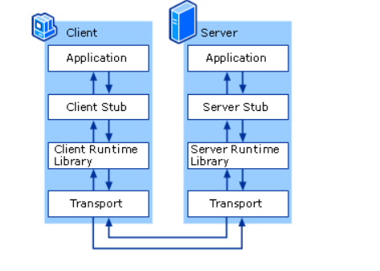

# RPC（Remote Procedure Call）
RPC远程过程调度，主要用于网络上进程之间的函数调用，适用于分布式系统，微服务的开发。  
它的调度过程如下：  


1. client调用client stub，这是一次本地过程调用  
2. client stub将参数打包成一个消息，然后发送这个消息。打包过程也叫做 marshalling  
3. client所在的系统将消息发送给server  
4. server的的系统将收到的包传给server stub  
5. server stub解包得到参数。 解包也被称作 unmarshalling  
6. 最后server stub调用服务过程. 返回结果按照相反的步骤传给client  

可以看到rpc最终也是通过transport在网络上传输，所以需要用到网络协议，一般常用的有TCP，HTTP等，也称为RPC over TCP、 RPC over HTTP。  

## RPC vs RESTful
1. RPC 的客户端和服务器端师紧耦合的
2. RPC 操作的是方法和过程， RESTful 操作的是资源(resource)，而不是方法
3. RESTful执行的是对资源的操作，主要是CURD
4. RPC性能更好，比如RPC over TCP可以通过长连接减少连接的建立所产生的花费。RESTful的keep-alive是request-response模型是阻塞的（http2.0除外）

关于更多的RPC可以参考：[link](https://smallnest.gitbooks.io/go-rpc-programming-guide)

## golang的RPC over HTTP实现

### Rpc Client
rpc.DialHTTP获取rcp client，然后直接通过call获取rpc函数执行结果。
```go
func main() {
	conn, err := rpc.DialHTTP("tcp", "127.0.0.1:8095")
	if err != nil {
		log.Fatalln("dailing error: ", err)
	}

	req := ArithRequest{9, 2}
	var res ArithResponse

	err = conn.Call("Arith.Multiply", req, &res) // 乘法运算
	if err != nil {
		log.Fatalln("arith error: ", err)
	}
	fmt.Printf("%d * %d = %d\n", req.A, req.B, res.Pro)

	err = conn.Call("Arith.Divide", req, &res)
	if err != nil {
		log.Fatalln("arith error: ", err)
	}
	fmt.Printf("%d / %d, quo is %d, rem is %d\n", req.A, req.B, res.Quo, res.Rem)
}
```
DialHTTP就是发送（DefaultRPCPath   = "/_goRPC_"）路径的HTTP CONNECT请求建立tunnel,然后通过NewClient返回rpcClient。
```go
func DialHTTPPath(network, address, path string) (*Client, error) {
	var err error
	conn, err := net.Dial(network, address)
	if err != nil {
		return nil, err
	}
	io.WriteString(conn, "CONNECT "+path+" HTTP/1.0\n\n")

	// Require successful HTTP response
	// before switching to RPC protocol.
	resp, err := http.ReadResponse(bufio.NewReader(conn), &http.Request{Method: "CONNECT"})
	if err == nil && resp.Status == connected {
		return NewClient(conn), nil
	}
	if err == nil {
		err = errors.New("unexpected HTTP response: " + resp.Status)
	}
	conn.Close()
	return nil, &net.OpError{
		Op:   "dial-http",
		Net:  network + " " + address,
		Addr: nil,
		Err:  err,
	}
}
```
我们先看一下client.Call，它是将rpc请求的method，req，reply封装到Call struct中，然后通过send发送请求。
```go
// Call represents an active RPC.
type Call struct {
	ServiceMethod string      // The name of the service and method to call.
	Args          interface{} // The argument to the function (*struct).
	Reply         interface{} // The reply from the function (*struct).
	Error         error       // After completion, the error status.
	Done          chan *Call  // Strobes when call is complete.
}
```
从send函数可以看到，seq是个rpc请求序列号，每个请求通过pending记录在map[uint64]*Call中，然后通过WriteRequest发送请求。
```go
func (client *Client) send(call *Call) {
	client.reqMutex.Lock()
	defer client.reqMutex.Unlock()

	// Register this call.
	client.mutex.Lock()
	if client.shutdown || client.closing {
		client.mutex.Unlock()
		call.Error = ErrShutdown
		call.done()
		return
	}
	seq := client.seq
	client.seq++
	client.pending[seq] = call
	client.mutex.Unlock()

	// Encode and send the request.
	client.request.Seq = seq
	client.request.ServiceMethod = call.ServiceMethod
	err := client.codec.WriteRequest(&client.request, call.Args)
	if err != nil {
		client.mutex.Lock()
		call = client.pending[seq]
		delete(client.pending, seq)
		client.mutex.Unlock()
		if call != nil {
			call.Error = err
			call.done()
		}
	}
}
```
WriteRequest可以看到，它首先序列化seq，method，reply，然后通过encBuf发送到socket。这里的encBuf其实就是前面conn New出来的一个writer。   
这样一个rpc请求就发送到服务端了。
```go
func (c *gobClientCodec) WriteRequest(r *Request, body interface{}) (err error) {
	if err = c.enc.Encode(r); err != nil {
		return
	}
	if err = c.enc.Encode(body); err != nil {
		return
	}
	return c.encBuf.Flush()
}
```
```go
func NewClient(conn io.ReadWriteCloser) *Client {
	encBuf := bufio.NewWriter(conn)
	client := &gobClientCodec{conn, gob.NewDecoder(conn), gob.NewEncoder(encBuf), encBuf}
	return NewClientWithCodec(client)
}

// NewClientWithCodec is like NewClient but uses the specified
// codec to encode requests and decode responses.
func NewClientWithCodec(codec ClientCodec) *Client {
	client := &Client{
		codec:   codec,
		pending: make(map[uint64]*Call),
	}
	go client.input()
	return client
}
```

接着可以看下如何处理请求的，这就是在我们NewClient的时候调用的input函数,当获取到response后就去pending里面拿到call并且删除，然后序列化call.Reply，
最后调用call.done返回。  
```go
func (client *Client) input() {
	var err error
	var response Response
	for err == nil {
		response = Response{}
		err = client.codec.ReadResponseHeader(&response)
		if err != nil {
			break
		}
		seq := response.Seq
		client.mutex.Lock()
		call := client.pending[seq]
		delete(client.pending, seq)
		client.mutex.Unlock()

		switch {
		case call == nil:
			// We've got no pending call. That usually means that
			// WriteRequest partially failed, and call was already
			// removed; response is a server telling us about an
			// error reading request body. We should still attempt
			// to read error body, but there's no one to give it to.
			err = client.codec.ReadResponseBody(nil)
			if err != nil {
				err = errors.New("reading error body: " + err.Error())
			}
		case response.Error != "":
			// We've got an error response. Give this to the request;
			// any subsequent requests will get the ReadResponseBody
			// error if there is one.
			call.Error = ServerError(response.Error)
			err = client.codec.ReadResponseBody(nil)
			if err != nil {
				err = errors.New("reading error body: " + err.Error())
			}
			call.done()
		default:
			err = client.codec.ReadResponseBody(call.Reply)
			if err != nil {
				call.Error = errors.New("reading body " + err.Error())
			}
			call.done()
		}
	}
	// Terminate pending calls.
	client.reqMutex.Lock()
	client.mutex.Lock()
	client.shutdown = true
	closing := client.closing
	if err == io.EOF {
		if closing {
			err = ErrShutdown
		} else {
			err = io.ErrUnexpectedEOF
		}
	}
	for _, call := range client.pending {
		call.Error = err
		call.done()
	}
	client.mutex.Unlock()
	client.reqMutex.Unlock()
	if debugLog && err != io.EOF && !closing {
		log.Println("rpc: client protocol error:", err)
	}
}
```

### Rpc Server
Arith是个struct，它实现了rpc function。然后调用rpc.Register注册rpc方法。  
这里面其实用到了DefaultServer的全局变量。
```go
func main() {
	rpc.Register(new(Arith)) // 注册rpc服务
	rpc.HandleHTTP()         // 采用http协议作为rpc载体

	lis, err := net.Listen("tcp", "127.0.0.1:8095")
	if err != nil {
		log.Fatalln("fatal error: ", err)
	}

	fmt.Fprintf(os.Stdout, "%s", "start connection")

	http.Serve(lis, nil)
}
```
```go
func Register(rcvr interface{}) error { return DefaultServer.Register(rcvr) }
```
```go
var DefaultServer = NewServer()
```

这里面我们每次Register的rpc服务都会组装成一个service struct然后保存到DefaultServer的serviceMap里面。
```go
type service struct {
	name   string                 // name of service
	rcvr   reflect.Value          // receiver of methods for the service
	typ    reflect.Type           // type of the receiver
	method map[string]*methodType // registered methods
}
```
```go
type Server struct {
	serviceMap sync.Map   // map[string]*service
	reqLock    sync.Mutex // protects freeReq
	freeReq    *Request
	respLock   sync.Mutex // protects freeResp
	freeResp   *Response
}
```
HandleHTTP就是把DefaultServer的ServeHTTP注册到DefaultServeMux的"/_goRPC_"路径。
```go
const (
	// Defaults used by HandleHTTP
	DefaultRPCPath   = "/_goRPC_"
	DefaultDebugPath = "/debug/rpc"
)
func HandleHTTP() {
	DefaultServer.HandleHTTP(DefaultRPCPath, DefaultDebugPath)
}
func (server *Server) HandleHTTP(rpcPath, debugPath string) {
	http.Handle(rpcPath, server)
	http.Handle(debugPath, debugHTTP{server})
}
func Handle(pattern string, handler Handler) { DefaultServeMux.Handle(pattern, handler) }
```

后面就是一个http.server去处理Listen的Accept的请求。   
这里可以看到就是前面的DefaultServeMux来处理请求的，所以流量就到达DefaultServer的ServeHTTP。
```go
func (sh serverHandler) ServeHTTP(rw ResponseWriter, req *Request) {
	handler := sh.srv.Handler
	if handler == nil {
		handler = DefaultServeMux
	}
	if req.RequestURI == "*" && req.Method == "OPTIONS" {
		handler = globalOptionsHandler{}
	}
	handler.ServeHTTP(rw, req)
}
```

这里可以看到只会处理CONNECT，也就是上面client通过DialHTTP发送过来的CONNECT，然后拿到conn，接下来只要处理这个conn的数据就ok了。
```go
func (server *Server) ServeHTTP(w http.ResponseWriter, req *http.Request) {
	if req.Method != "CONNECT" {
		w.Header().Set("Content-Type", "text/plain; charset=utf-8")
		w.WriteHeader(http.StatusMethodNotAllowed)
		io.WriteString(w, "405 must CONNECT\n")
		return
	}
	conn, _, err := w.(http.Hijacker).Hijack()
	if err != nil {
		log.Print("rpc hijacking ", req.RemoteAddr, ": ", err.Error())
		return
	}
	io.WriteString(conn, "HTTP/1.0 "+connected+"\n\n")
	server.ServeConn(conn)
}
```
```go
func (server *Server) ServeConn(conn io.ReadWriteCloser) {
	buf := bufio.NewWriter(conn)
	srv := &gobServerCodec{
		rwc:    conn,
		dec:    gob.NewDecoder(conn),
		enc:    gob.NewEncoder(buf),
		encBuf: buf,
	}
	server.ServeCodec(srv)
}
```

ServeCodec会去读取请求数据，然后反序列化，然后开启一个golang来执行rpc的method并返回执行结果。
```go
func (server *Server) ServeCodec(codec ServerCodec) {
	sending := new(sync.Mutex)
	wg := new(sync.WaitGroup)
	for {
		service, mtype, req, argv, replyv, keepReading, err := server.readRequest(codec)
		if err != nil {
			if debugLog && err != io.EOF {
				log.Println("rpc:", err)
			}
			if !keepReading {
				break
			}
			// send a response if we actually managed to read a header.
			if req != nil {
				server.sendResponse(sending, req, invalidRequest, codec, err.Error())
				server.freeRequest(req)
			}
			continue
		}
		wg.Add(1)
		go service.call(server, sending, wg, mtype, req, argv, replyv, codec)
	}
	// We've seen that there are no more requests.
	// Wait for responses to be sent before closing codec.
	wg.Wait()
	codec.Close()
}
```
```go
func (s *service) call(server *Server, sending *sync.Mutex, wg *sync.WaitGroup, mtype *methodType, req *Request, argv, replyv reflect.Value, codec ServerCodec) {
	if wg != nil {
		defer wg.Done()
	}
	mtype.Lock()
	mtype.numCalls++
	mtype.Unlock()
	function := mtype.method.Func
	// Invoke the method, providing a new value for the reply.
	returnValues := function.Call([]reflect.Value{s.rcvr, argv, replyv})
	// The return value for the method is an error.
	errInter := returnValues[0].Interface()
	errmsg := ""
	if errInter != nil {
		errmsg = errInter.(error).Error()
	}
	server.sendResponse(sending, req, replyv.Interface(), codec, errmsg)
	server.freeRequest(req)
}
```

这里面方法的注册和查找都是通过反射来完成的，后面有时间再补充。