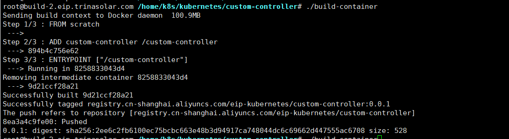
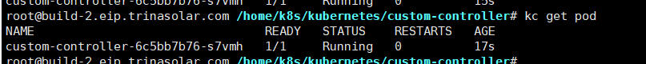
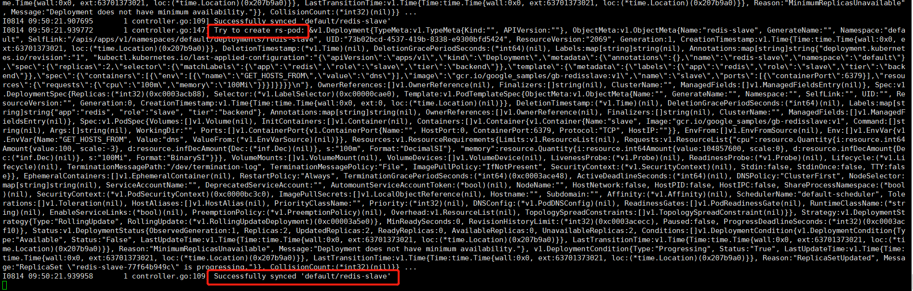
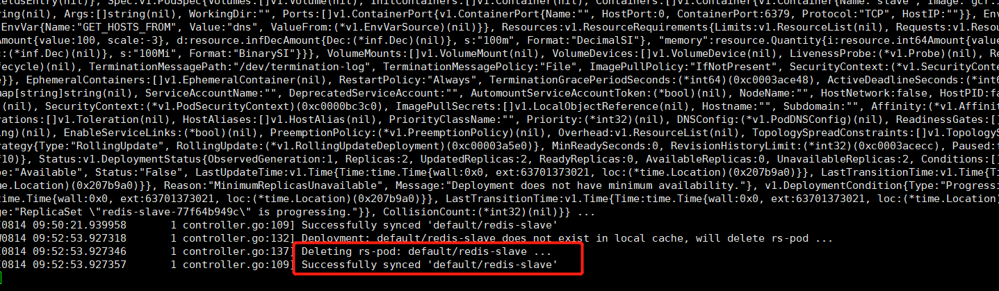
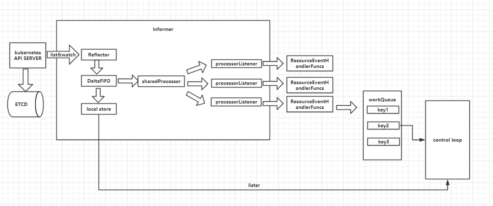

# Custom Controller
在[Initializer](./dynamic_admission_control.md)中基于informer已经实现了简单的自定义控制器。
这里将实现基于SharedInformer和WorkQueue实现更加完善的自定义控制器。  
在kube-controller-manager中有非常多的控制器，可以在pkg/controller目录下查看。
  
它们都是以控制器循环的模式，对API对象进行Reconcile。

## 自定义控制器代码
以deployment API做为控制器对象，当监听到deployment变化的时候我们进行日志输出，而不做实际的业务逻辑。
自定义控制器一般是对CRD（Custom Resource Definition）自定义API资源对象进行控制的，后面再写如何实现CRD。

### main
main函数首先获取容器内集群的默认配置，然后创建client，接着创建informer的工厂，然后通过deployment和client创建controller，最后启动informer和控制器。
informer工厂目的就是管理各种API对象的informer，方便不同controller共享informer。
```go
func main() {
	stopCh := server.SetupSignalHandler()

	clusterConfig, err := rest.InClusterConfig()
	if err != nil {
		log.Fatal(err.Error())
	}

	clientset, err := kubernetes.NewForConfig(clusterConfig)
	if err != nil {
		log.Fatal(err)
	}

	resyncPeriod := 30 * time.Second
	ifm := informers.NewSharedInformerFactory(clientset, resyncPeriod)
	c := controller.NewController(clientset, ifm.Apps().V1().Deployments())

	go ifm.Start(stopCh)
	c.Run(2, stopCh)
}
```
controller对象主要包含k8sclient(集群交互)，DeploymentLister（获取本地缓存中的api对象），InformerSynced（用于等待本地缓存同步），workqueue（工作队列）
### Controller
```go
type Controller struct {
	kubeclientset     kubernetes.Interface
	deploymentLister  listersv1.DeploymentLister
	deploymentsSynced cache.InformerSynced
	workqueue         workqueue.RateLimitingInterface
}
```
创建controller，最主要就是往informer中注册EventHandler，而这里的EventHandler不是具体的控制器循环逻辑，
而是把监听到的API对象的key（namespace/name）添加到workqueue，控制器循环是从workqueue获取变化的API对象的key，然后从本地缓存获取具体API对象。  
workqueue对于同一个key只会保存一份，但本地缓存会保存最新的API对象，从而使控制器不需要处理中间状态，这也是kubernetes level trigger的设计。  
在UpdateFunc中一般会判断ResourceVersion是否有更新，因为对于list请求也会产生Update事件。   
informer和控制器循环之间添加workqueue主要是解耦，防止控制器循环执行太慢阻塞informer。

### NewController
```go
func NewController(
	kubeclientset kubernetes.Interface,
	deploymentInformer v1.DeploymentInformer) *Controller {

	controller := &Controller{
		kubeclientset:     kubeclientset,
		deploymentLister:  deploymentInformer.Lister(),
		deploymentsSynced: deploymentInformer.Informer().HasSynced,
		workqueue:         workqueue.NewNamedRateLimitingQueue(workqueue.DefaultControllerRateLimiter(), "deployment"),
	}

	glog.Info("Setting up event handlers")

	deploymentInformer.Informer().AddEventHandler(cache.ResourceEventHandlerFuncs{
		AddFunc: controller.enqueueDeployment,
		UpdateFunc: func(old, new interface{}) {
			oldDeployment := old.(*appsv1.Deployment)
			newDeployment := new.(*appsv1.Deployment)
			if oldDeployment.ResourceVersion == newDeployment.ResourceVersion {
				return
			}
			controller.enqueueDeployment(new)
		},
		DeleteFunc: controller.enqueueDeploymentForDelete,
	})

	return controller
}
```
在启动控制器循环中会等待本地缓存同步，然后定期的执行runWorker。
因为在本地缓存同步之前获取的信息不准确，会有中间状态，所以启动前先同步本地缓存。
### (c *Controller) Run
```go
func (c *Controller) Run(threadiness int, stopCh <-chan struct{}) error {
	defer runtime.HandleCrash()
	defer c.workqueue.ShutDown()

	glog.Info("Starting Deployment control loop")

	glog.Info("Waiting for informer caches to sync")
	if ok := cache.WaitForCacheSync(stopCh, c.deploymentsSynced); !ok {
		return fmt.Errorf("failed to wait for caches to sync")
	}

	glog.Info("Starting workers")

	for i := 0; i < threadiness; i++ {
		go wait.Until(c.runWorker, time.Second, stopCh)
	}

	glog.Info("Started workers")
	<-stopCh
	glog.Info("Shutting down workers")

	return nil
}
```
### (c *Controller) runWorker()
```go
func (c *Controller) runWorker() {
	for c.processNextWorkItem() {
	}
}
```
processNextWorkItem就是从队列中获取api对象的key，然后执行syncHandler函数。
### (c *Controller) processNextWorkItem()
```go
func (c *Controller) processNextWorkItem() bool {
	obj, shutdown := c.workqueue.Get()

	if shutdown {
		return false
	}

	err := func(obj interface{}) error {

		defer c.workqueue.Done(obj)
		var key string
		var ok bool

		if key, ok = obj.(string); !ok {

			c.workqueue.Forget(obj)
			runtime.HandleError(fmt.Errorf("expected string in workqueue but got %#v", obj))
			return nil
		}

		if err := c.syncHandler(key); err != nil {
			return fmt.Errorf("error syncing '%s': %s", key, err.Error())
		}

		c.workqueue.Forget(obj)
		glog.Infof("Successfully synced '%s'", key)
		return nil
	}(obj)

	if err != nil {
		runtime.HandleError(err)
		return true
	}

	return true
}
```
这里就可以执行控制器循环具体的业务逻辑了，获取到key后发现在本地缓存中没有api对象，表明已经删除就可以执行具体删除的业务逻辑。
如果获取到api对象，就和实际情况进行对比，执行创建或者更新操作。
### (c *Controller) syncHandler
```go
func (c *Controller) syncHandler(key string) error {

	namespace, name, err := cache.SplitMetaNamespaceKey(key)
	if err != nil {
		runtime.HandleError(fmt.Errorf("invalid resource key: %s", key))
		return nil
	}

	deployment, err := c.deploymentLister.Deployments(namespace).Get(name)
	if err != nil {
		if errors.IsNotFound(err) {
			glog.Warningf("Deployment: %s/%s does not exist in local cache, will delete rs-pod ...",
				namespace, name)

			//TODO
			//这里就可以执行删除的业务逻辑
			glog.Infof("Deleting rs-pod: %s/%s ...", namespace, name)

			return nil
		}
		runtime.HandleError(fmt.Errorf("failed to list deployment by: %s/%s", namespace, name))
		return err
	}
	//TODO
	//这里通过比较期望状态和实际业务状态，执行创建或者更新的业务逻辑

	glog.Infof("Try to create rs-pod: %#v ...", deployment)

	return nil
}

```
## 测试
代码在[github](https://github.com/yansunkai/custom-controller)上。
  
首先运行： ./build-container
 
运行： kubectl apply -f Deployment.yaml  
我们看到custom-controller容器已经正常运行
 
我们打开日志： kc logs custom-controller-6c5bb7b76-s7vmh  -f  
在集群中创建一个deployment后日志会显示：
 
删除一个deployment：
 


## Custom Controller流程图
 

## SharedInformerFactory
补充一下SharedInformerFactory的实现。

### NewSharedInformerFactoryWithOptions
```go
func NewSharedInformerFactoryWithOptions(client kubernetes.Interface, defaultResync time.Duration, options ...SharedInformerOption) SharedInformerFactory {
	factory := &sharedInformerFactory{
		client:           client,
		namespace:        v1.NamespaceAll,
		defaultResync:    defaultResync,
		informers:        make(map[reflect.Type]cache.SharedIndexInformer),
		startedInformers: make(map[reflect.Type]bool),
		customResync:     make(map[reflect.Type]time.Duration),
	}

	// Apply all options
	for _, opt := range options {
		factory = opt(factory)
	}

	return factory
}
```
NewSharedInformerFactoryWithOptions就是创建一个sharedInformerFactory对象。每个Factory是限定namespace的，当然也可以指定NamespaceAll。
这里面设置options的方法是自定义函数的形式，其实就是直接修改*sharedInformerFactory对象。
sharedInformerFactory中关键的字段就是informers，就是保存各种API对象的SharedIndexInformer。
### SharedInformerOption
```go
type SharedInformerOption func(*sharedInformerFactory) *sharedInformerFactory
```
### sharedInformerFactory
```go
type sharedInformerFactory struct {
	client           kubernetes.Interface
	namespace        string
	tweakListOptions internalinterfaces.TweakListOptionsFunc
	lock             sync.Mutex
	defaultResync    time.Duration
	customResync     map[reflect.Type]time.Duration

	informers map[reflect.Type]cache.SharedIndexInformer
	// startedInformers is used for tracking which informers have been started.
	// This allows Start() to be called multiple times safely.
	startedInformers map[reflect.Type]bool
}
```
factory的start函数就是启动各种API对象的informer。
### (f *sharedInformerFactory) Start
```go
func (f *sharedInformerFactory) Start(stopCh <-chan struct{}) {
	f.lock.Lock()
	defer f.lock.Unlock()

	for informerType, informer := range f.informers {
		if !f.startedInformers[informerType] {
			go informer.Run(stopCh)
			f.startedInformers[informerType] = true
		}
	}
}
```

InformerFor通过自定义NewInformerFunc函数向factory添加informer，InformerFor函数保证不重复创建informer。
那我们需要自己写NewInformerFunc函数创建informer？ 
其实每个API对象都给我们封装好了各种的informer对象。我们可以通过调用Factory的函数实现自动注册并获取到informer。
### (f *sharedInformerFactory) InformerFor
```go
func (f *sharedInformerFactory) InformerFor(obj runtime.Object, newFunc internalinterfaces.NewInformerFunc) cache.SharedIndexInformer {
	f.lock.Lock()
	defer f.lock.Unlock()

	informerType := reflect.TypeOf(obj)
	informer, exists := f.informers[informerType]
	if exists {
		return informer
	}

	resyncPeriod, exists := f.customResync[informerType]
	if !exists {
		resyncPeriod = f.defaultResync
	}

	informer = newFunc(f.client, resyncPeriod)
	f.informers[informerType] = informer

	return informer
}
```

例如要获取deployment对象的informer,这里我们看到Informer()会为我们调用InformerFor注册deployment API对象的informer。
这里需要注意的是，在start Factory前，我们需要调用一下我们要使用的informer例如：ifm.Apps().V1().Deployments().Informer()进行注册。
### ifm.Apps().V1().Deployments().Informer()
```go
func (f *deploymentInformer) Informer() cache.SharedIndexInformer {
	return f.factory.InformerFor(&appsv1.Deployment{}, f.defaultInformer)
}
```
### defaultInformer
```go
func (f *deploymentInformer) defaultInformer(client kubernetes.Interface, resyncPeriod time.Duration) cache.SharedIndexInformer {
	return NewFilteredDeploymentInformer(client, f.namespace, resyncPeriod, cache.Indexers{cache.NamespaceIndex: cache.MetaNamespaceIndexFunc}, f.tweakListOptions)
}
```
### NewFilteredDeploymentInformer
```go
func NewFilteredDeploymentInformer(client kubernetes.Interface, namespace string, resyncPeriod time.Duration, indexers cache.Indexers, tweakListOptions internalinterfaces.TweakListOptionsFunc) cache.SharedIndexInformer {
	return cache.NewSharedIndexInformer(
		&cache.ListWatch{
			ListFunc: func(options metav1.ListOptions) (runtime.Object, error) {
				if tweakListOptions != nil {
					tweakListOptions(&options)
				}
				return client.AppsV1().Deployments(namespace).List(options)
			},
			WatchFunc: func(options metav1.ListOptions) (watch.Interface, error) {
				if tweakListOptions != nil {
					tweakListOptions(&options)
				}
				return client.AppsV1().Deployments(namespace).Watch(options)
			},
		},
		&appsv1.Deployment{},
		resyncPeriod,
		indexers,
	)
}
```