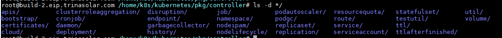

# Custom Controller
在[Initializer](./dynamic_admission_control.md)中基于informer已经实现了简单的自定义控制器。
这里将实现基于SharedInformer和WorkQueue实现更加完善的自定义控制器。  
在kube-controller-manager中有非常多的控制器，可以在pkg/controller目录下查看。
  
它们都是以控制器循环的模式，对API对象进行Reconcile。
