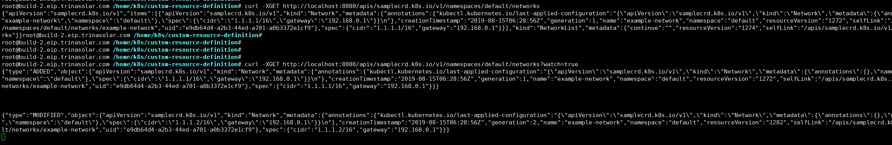
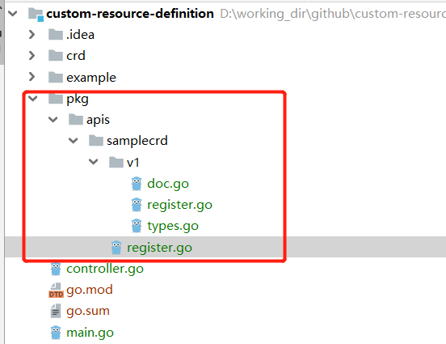
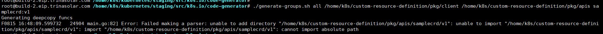

# CRD(Custom Resource Definition)

## 创建Network API对象
这里我们就指定了group为samplecrd.k8s.io，版本号v1的network API对象。
```yaml
apiVersion: apiextensions.k8s.io/v1beta1
kind: CustomResourceDefinition
metadata:
  name: networks.samplecrd.k8s.io
spec:
  group: samplecrd.k8s.io
  version: v1
  names:
    kind: Network
    plural: networks
  scope: Namespaced
```

我们可以写一个network的yaml来创建这个network对象
```yaml
apiVersion: samplecrd.k8s.io/v1
kind: Network
metadata:
  name: example-network
spec:
  cidr: "192.168.0.0/16"
  gateway: "192.168.0.1"
```

通过命令：kubectl get network，就可以查看这个API对象了
 
而且通过API servers的接口也可以listwatch这个API对象的变化

既然可以listwatch到api对象，就可以通过控制器循环来监听对象的变化，然后进行具体的创建，删除，更新的业务逻辑。
在[custom_controller](./custom_controller.md)这篇中，我们很方便了写了一个deployment的控制器循环，
这是因为client-go已经为我们提供了deployment的informer，lister，clientset，typeDefine等。
那对于自定义的CRD，kubernetes为我们提供了标准的代码生成工具，我们只要简单的写一些代码和注解就可以生成标准的client。

## 自动生成代码
这篇blog很详细的介绍了代码生成方法[link](https://blog.openshift.com/kubernetes-deep-dive-code-generation-customresources)

创建一个这样的目录树
 
他们的内容可以参考我的github库[link](https://github.com/yansunkai/custom-resource-definition)
这里面主要是一个type的定义包括TypeMeta，ObjectMeta，Spec，Status字段可选。然后还得定义一个复数类型NetworkList，因为list方法返回的并不是数组而是list类型。

最后在code-generator包中运行命令： 
```shell
./generate-groups.sh all custom-resource-definition/pkg/client custom-resource-definition/pkg/apis samplecrd:v1
```
好像必须在gopath中才能生成成功。  
我用go mod会报如下错误，待解决。
 
