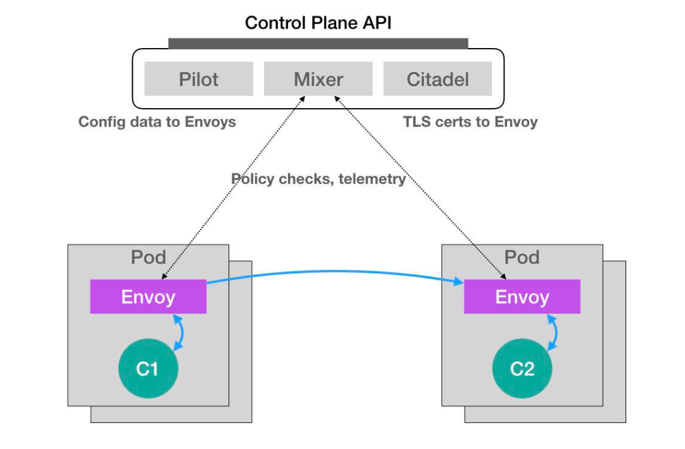

# Initializer(1.14版本已废除，请使用webhook)
Initializer就是利用kubernetes的声明式api，在用户提交api对象的时候可以通过patch操作对提交的api对象进行merge操作。  

## 如何使用Initializer
我们以微服务治理Istio项目如何在集群中以sidecar形式给每个pod部署Envoy容器来举例：  
### Initializer效果
Istio项目就是在我们启动的业务容器里添加一个envoy容器，这样和业务容器共享Network Namespace，然后通过配置iptables规则来接管进出pod的流量。  
  
```yaml
apiVersion: v1
kind: Pod
metadata:
  name: myapp-pod
  labels:
    app: myapp
spec:
  containers:
  - name: myapp-container
    image: busybox
    command: ['sh', '-c', 'echo Hello Kubernetes! && sleep 3600']
  - name: envoy
    image: lyft/envoy:latest
    command: ["/usr/local/bin/envoy"]
    ...
```

### Istio如何使用Initializer自动注入envoy容器
#### 1. 首先在集群中，以configmap的形式保存envoy容器的定义：  
```yaml
apiVersion: v1
kind: ConfigMap
metadata:
  name: envoy-initializer
data:
  config: |
    containers:
      - name: envoy
        image: lyft/envoy:latest
        command: ["/usr/local/bin/envoy"]
        args:
          - "--concurrency 4"
          - "--config-path /etc/envoy/envoy.json"
          - "--mode serve"
        ports:
          - containerPort: 80
            protocol: TCP
        resources:
          limits:
            cpu: "1000m"
            memory: "512Mi"
          requests:
            cpu: "100m"
            memory: "64Mi"
        volumeMounts:
          - name: envoy-conf
            mountPath: /etc/envoy
    volumes:
      - name: envoy-conf
        configMap:
          name: envoy
```

#### 2. 在集群中以deployment形式部署envoy-initializer的自定义控制器：  
```yaml
apiVersion: apps/v1beta1
kind: Deployment
metadata:
  initializers:
    pending: []
  labels:
    app: envoy-initializer
  name: envoy-initializer
spec:
  replicas: 1
  template:
    metadata:
      labels:
        app: envoy-initializer
      name: envoy-initializer
    spec:
      containers:
        - name: envoy-initializer
          image: resouer/envoy-initializer:latest
          imagePullPolicy: Always
```
envoy-initializer就是自定义控制器，它主要功能是当某个api对象需要envoy-initializer控制器处理时（InitializerConfiguration来配置），
它就判断pod中是否已经添加了envoy容器，如果未添加就把刚刚envoy-initializer configmap中定义的containers字段merge到pod对象然后进行提交。  
大致的代码如下：  
获取上面configmap中保存的envoy容器定义
```go
clusterConfig, err := rest.InClusterConfig()
	if err != nil {
		log.Fatal(err.Error())
	}

	clientset, err := kubernetes.NewForConfig(clusterConfig)
	if err != nil {
		log.Fatal(err)
	}

	// Load the Envoy Initializer configuration from a Kubernetes ConfigMap.
	cm, err := clientset.CoreV1().ConfigMaps(namespace).Get(configmap, metav1.GetOptions{})
	if err != nil {
		log.Fatal(err)
	}

	c, err := configmapToConfig(cm)
	
func configmapToConfig(configmap *corev1.ConfigMap) (*config, error) {
	var c config
	err := yaml.Unmarshal([]byte(configmap.Data["config"]), &c)
	if err != nil {
		return nil, err
	}
	return &c, nil
}
```
ListWatch所有的uninitialized Deployments，交给initializeDeployment  
```go
// Watch uninitialized Deployments in all namespaces.
	restClient := clientset.AppsV1beta1().RESTClient()
	watchlist := cache.NewListWatchFromClient(restClient, "deployments", corev1.NamespaceAll, fields.Everything())

	// Wrap the returned watchlist to workaround the inability to include
	// the `IncludeUninitialized` list option when setting up watch clients.
	includeUninitializedWatchlist := &cache.ListWatch{
		ListFunc: func(options metav1.ListOptions) (runtime.Object, error) {
			options.IncludeUninitialized = true
			return watchlist.List(options)
		},
		WatchFunc: func(options metav1.ListOptions) (watch.Interface, error) {
			options.IncludeUninitialized = true
			return watchlist.Watch(options)
		},
	}

	resyncPeriod := 30 * time.Second

	_, controller := cache.NewInformer(includeUninitializedWatchlist, &v1beta1.Deployment{}, resyncPeriod,
		cache.ResourceEventHandlerFuncs{
			AddFunc: func(obj interface{}) {
				err := initializeDeployment(obj.(*v1beta1.Deployment), c, clientset)
				if err != nil {
					log.Println(err)
				}
			},
		},
	)
```
initializeDeployment中首先判断该deployment是否属于该Initializer处理
```go
func initializeDeployment(deployment *v1beta1.Deployment, c *config, clientset *kubernetes.Clientset) error {
	if deployment.ObjectMeta.GetInitializers() != nil {
		pendingInitializers := deployment.ObjectMeta.GetInitializers().Pending

		if initializerName == pendingInitializers[0].Name {
			log.Printf("Initializing deployment: %s", deployment.Name)
```
如果是自己处理的话，对处理对象进行深拷贝，然后删除metadata.initializers.pending字段，
根据requireAnnotation flag是否需要判断Annotations注解，一般都设置为false
```go
			o, err := runtime.NewScheme().DeepCopy(deployment)
			if err != nil {
				return err
			}
			initializedDeployment := o.(*v1beta1.Deployment)

			// Remove self from the list of pending Initializers while preserving ordering.
			if len(pendingInitializers) == 1 {
				initializedDeployment.ObjectMeta.Initializers = nil
			} else {
				initializedDeployment.ObjectMeta.Initializers.Pending = append(pendingInitializers[:0], pendingInitializers[1:]...)
			}

			if requireAnnotation {
				a := deployment.ObjectMeta.GetAnnotations()
				_, ok := a[annotation]
				if !ok {
					log.Printf("Required '%s' annotation missing; skipping envoy container injection", annotation)
					_, err = clientset.AppsV1beta1().Deployments(deployment.Namespace).Update(initializedDeployment)
					if err != nil {
						return err
					}
					return nil
				}
			}
```
然后把刚刚configmap中取得的envoy容器的containers和volume字段进行append，然后和原先的deployment进行merge，最后提交patch
```go
            // Modify the Deployment's Pod template to include the Envoy container
			// and configuration volume. Then patch the original deployment.
			initializedDeployment.Spec.Template.Spec.Containers = append(deployment.Spec.Template.Spec.Containers, c.Containers...)
			initializedDeployment.Spec.Template.Spec.Volumes = append(deployment.Spec.Template.Spec.Volumes, c.Volumes...)

			oldData, err := json.Marshal(deployment)
			if err != nil {
				return err
			}

			newData, err := json.Marshal(initializedDeployment)
			if err != nil {
				return err
			}

			patchBytes, err := strategicpatch.CreateTwoWayMergePatch(oldData, newData, v1beta1.Deployment{})
			if err != nil {
				return err
			}

			_, err = clientset.AppsV1beta1().Deployments(deployment.Namespace).Patch(deployment.Name, types.StrategicMergePatchType, patchBytes)
			if err != nil {
				return err
			}
```

#### 3. InitializerConfiguration配置需要对哪些资源进行Initialize操作：  
```yaml
apiVersion: admissionregistration.k8s.io/v1alpha1
kind: InitializerConfiguration
metadata:
  name: envoy
initializers:
  - name: envoy.initializer.kubernetes.io
    rules:
      - apiGroups:
          - "*"
        apiVersions:
          - "*"
        resources:
          - deployments
```
实际上kubernetes就是根据InitializerConfiguration对提交的deployments对象添加如下信息：
```yaml
apiVersion: v1
kind: Deployment
metadata:
  initializers:
    pending:
      - name: envoy.initializer.kubernetes.io
  name: myapp-pod
  labels:
    app: myapp
...
```
而我们刚刚的initializeDeployment方法中就是判断metadata.initializers.pending标记是否存在，如果存在就表明该对象还没有进行initialize操作。
所以在编写Initializer控制器的时候，完成initialize操作后一定要删除metadata.initializers.pending标记。

除此之外，你还可以在Annotation中添加如下字段来声明要使用哪些Initializer：  
```yaml
apiVersion: v1
kind: Pod
metadata
  annotations:
    "initializer.kubernetes.io/envoy": "true"
    ...
```

[具体Demo可以参考github链接](https://github.com/kelseyhightower/kubernetes-initializer-tutorial)