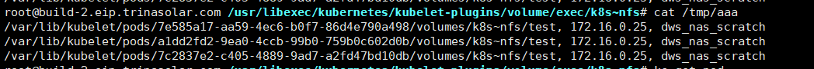

# FlexVolume

## kubernetes为pod挂载volume过程
首先介绍一下kubernetes挂在volume的过程。  

首先kubelet会在下面目录给pod创建一个挂载路径。
```bash
/var/lib/kubelet/pods/<podID>/volumes/kubernetes.io~<volume type>/<volume name>
例如：/var/lib/kubelet/pods/3fd57144-7306-4a24-a706-43fdfd32f6ab/volumes/kubernetes.io~secret/kube-dns-token-g94m4
```
然后根据要挂在volume的类型完成Attach操作  
如果是远程块存储，就调用存储服务端的API完成Attach操作  
如果是本地存储或者文件存储nfs，就不需要attach操作。  
Attach阶段是kube-controller-manager的AttachDetachController完成的  

接着执行mount操作，将磁盘格式化并挂在到上面的目录。  
```bash
mount -t nfs <NFS 服务器地址 >:/ /var/lib/kubelet/pods/<podID>/volumes/kubernetes.io~<volume type>/<volume name> 
```
mount是在kubelet的VolumeManagerReconciler完成的。  

最后直接挂在进容器就OK了。比如CRI是docker的话就是：  
```bash
docker run -v /var/lib/kubelet/pods/<podID>/volumes/kubernetes.io~<volume type>/<volume name> :/< 容器内的目标目录 > image ...
```

## FlexVolume插件
FlexVolume的原理其实就是运行特定路径下面的插件执行 attach，detach，mount，unmount的过程。  
插件的存放路径：
```bash
/usr/libexec/kubernetes/kubelet-plugins/volume/exec/<vendor>~<driver>/<driver>
```

例如mount的过程  
在"pkg/volume/flexvolume"的mounter.go
#### (f *flexVolumeMounter) SetUp
```go
func (f *flexVolumeMounter) SetUp(mounterArgs volume.MounterArgs) error {
	return f.SetUpAt(f.GetPath(), mounterArgs)
}
```

#### (f *flexVolume) GetPath
```go
func (f *flexVolume) GetPath() string {
	name := f.driverName
	return f.plugin.host.GetPodVolumeDir(f.podUID, utilstrings.EscapeQualifiedName(name), f.volName)
}
```

#### (f *flexVolumeMounter) SetUpAt
```go
func (f *flexVolumeMounter) SetUpAt(dir string, mounterArgs volume.MounterArgs) error {
	// Mount only once.
	alreadyMounted, err := prepareForMount(f.mounter, dir)
	if err != nil {
		return err
	}
	if alreadyMounted {
		return nil
	}

	call := f.plugin.NewDriverCall(mountCmd)

	// Interface parameters
	call.Append(dir)

	extraOptions := make(map[string]string)

	// pod metadata
	extraOptions[optionKeyPodName] = f.podName
	extraOptions[optionKeyPodNamespace] = f.podNamespace
	extraOptions[optionKeyPodUID] = string(f.podUID)
	// service account metadata
	extraOptions[optionKeyServiceAccountName] = f.podServiceAccountName

	// Extract secret and pass it as options.
	if err := addSecretsToOptions(extraOptions, f.spec, f.podNamespace, f.driverName, f.plugin.host); err != nil {
		os.Remove(dir)
		return err
	}

	// Implicit parameters
	if mounterArgs.FsGroup != nil {
		extraOptions[optionFSGroup] = strconv.FormatInt(int64(*mounterArgs.FsGroup), 10)
	}

	call.AppendSpec(f.spec, f.plugin.host, extraOptions)

	_, err = call.Run()
```
在call.Append(dir)中，就是把上面讲到的kubelet mount volume的路径作为cmd的一个参数，而第二参数是json格式包含各种options。
其中就包括我们flexvolume中的options参数，类型是map[string]string  
```yaml
volumes:
  - name: test
    flexVolume:
      driver: "k8s/nfs"
      fsType: "nfs"
      options:
        server: "172.16.0.25"
        share: "dws_nas_scratch"
```

```go
func (dc *DriverCall) Run() (*DriverStatus, error) {
	if dc.plugin.isUnsupported(dc.Command) {
		return nil, errors.New(StatusNotSupported)
	}
	execPath := dc.plugin.getExecutable()

	cmd := dc.plugin.runner.Command(execPath, dc.args...)

	timeout := false
	if dc.Timeout > 0 {
		timer := time.AfterFunc(dc.Timeout, func() {
			timeout = true
			cmd.Stop()
		})
		defer timer.Stop()
	}

	output, execErr := cmd.CombinedOutput()
```
从RUN函数可以看出，最后就是指向cmd命令，而这个cmd命令最后就是：  
```bash
/usr/libexec/kubernetes/kubelet-plugins/volume/exec/k8s~nfs/nfs mount <mount dir> <json param>
```
其中k8s~nfs/nfs就是从driver: "k8s/nfs"解析出来的 其中k8s就是vendor名称，nfs就是driver名称。 

flexvolume的过程主要包括：init，attach，detach，mount，unmount。

## nfs flexvolume shell
```jshelllanguage
op=$1

if ! command -v jq >/dev/null 2>&1; then
        err "{ \"status\": \"Failure\", \"message\": \"'jq' binary not found. Please install jq package before using this driver\"}"
        exit 1
fi

if [ "$op" = "init" ]; then
        log '{"status": "Success", "capabilities": {"attach": false}}'
        exit 0
fi

if [ $# -lt 2 ]; then
        usage
fi

shift

case "$op" in
        mount)
                domount $*
                ;;
        unmount)
                unmount $*
                ;;
        *)
                log '{"status": "Not supported"}'
                exit 0
esac

exit 1

```
首先根据参数$1判断执行过程，如果是init，返回特性格式告诉flexvolume驱动不用执行attach操作。  
然后如果是mount过程 执行如下函数：
```jshelllanguage
domount() {
        MNTPATH=$1

        NFS_SERVER=$(echo $2 | jq -r '.server')
        SHARE=$(echo $2 | jq -r '.share')

#       if [ $(ismounted) -eq 1 ] ; then
#               log '{"status": "Success"}'
#               exit 0
#       fi

        echo "${MNTPATH}, ${NFS_SERVER}, ${SHARE}" >> /tmp/aaa

        mkdir -p ${MNTPATH} &> /dev/null

#       mount -t nfs ${NFS_SERVER}:/${SHARE} ${MNTPATH} &> /dev/null
#       if [ $? -ne 0 ]; then
#               err "{ \"status\": \"Failure\", \"message\": \"Failed to mount ${NFS_SERVER}:${SHARE} at ${MNTPATH}\"}"
#               exit 1
#       fi
        log '{"status": "Success"}'
        exit 0
}
```
这里我把真正的nfs mount过程注释掉了，然后把前面提取的参数输入到/tmp/aaa。  
然后当我们执行创建pod后，就会执行mount，然后把参数输入到/tmp/aaa， 而且会创建 ${MNTPATH}  
```yaml
apiVersion: v1
kind: Pod
metadata:
  name: nginx-nfs
  namespace: default
spec:
  containers:
  - name: nginx-nfs
    image: nginx
    volumeMounts:
    - name: test
      mountPath: /data
    ports:
    - containerPort: 80
  volumes:
  - name: test
    flexVolume:
      driver: "k8s/nfs"
      fsType: "nfs"
      options:
        server: "172.16.0.25"
        share: "dws_nas_scratch"
```
效果：   
   

   

具体可以参考：[LINK](https://github.com/kubernetes/examples/tree/master/staging/volumes/flexvolume)

在集群中使用flexvolume的话一般用DaemonSet的形式在每个node上部署plugin，然后mount hostpath，拷贝二进制到hostpath。  
如下： 
```bash
#!/bin/sh

set -o errexit
set -o pipefail

VENDOR=k8s.io
DRIVER=nfs

# Assuming the single driver file is located at /$DRIVER inside the DaemonSet image.

driver_dir=$VENDOR${VENDOR:+"~"}${DRIVER}
if [ ! -d "/flexmnt/$driver_dir" ]; then
  mkdir "/flexmnt/$driver_dir"
fi

cp "/$DRIVER" "/flexmnt/$driver_dir/.$DRIVER"
mv -f "/flexmnt/$driver_dir/.$DRIVER" "/flexmnt/$driver_dir/$DRIVER"

while : ; do
  sleep 3600
done
```

```yaml
apiVersion: extensions/v1beta1
kind: DaemonSet
metadata:
  name: flex-set
spec:
  template:
    metadata:
      name: flex-deploy
      labels:
        app: flex-deploy
    spec:
      containers:
        - image: <deployment_image>
          name: flex-deploy
          securityContext:
              privileged: true
          volumeMounts:
            - mountPath: /flexmnt
              name: flexvolume-mount
      volumes:
        - name: flexvolume-mount
          hostPath:
            path: <host_driver_directory>
```

kubelet关注这个参数是否有controoler-manage来执行attach操作。
```yaml
--enable-controller-attach-detach
Enables the Attach/Detach controller to manage attachment/detachment of volumes scheduled to this node, and disables kubelet from executing any attach/detach operations (default true)
```