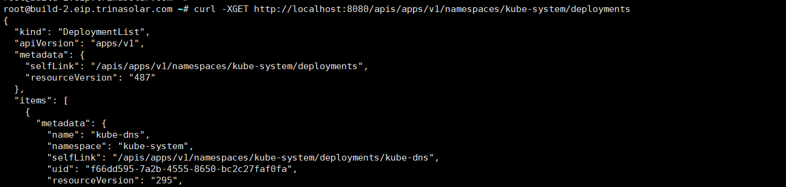
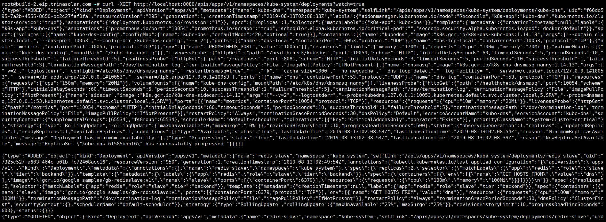
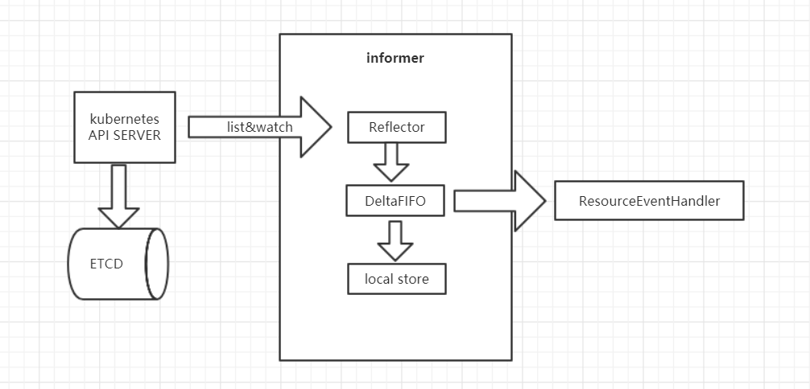

# Informer
Informer主要是将对API Server Listwatch到的api对象进行缓存，减少API Server的压力，同时获取api对象的创建，删除或修改事件触发ResourceEventHandlerFuncs。

## informer代码解析
我们可以用InClusterConfig获取集群的配置（默认挂载进pod的ServiceAccount），然后创建监控所有namespace下的Apps/V1beta1/deployments的watchlist对象，
通过cache.NewInformer返回store，controller，然后通过controller.Run启动informer和控制循环。
```go
	clusterConfig, err := rest.InClusterConfig()
	if err != nil {
		log.Fatal(err.Error())
	}

	clientset, err := kubernetes.NewForConfig(clusterConfig)
	if err != nil {
		log.Fatal(err)
	}
	restClient := clientset.AppsV1beta1().RESTClient()
	watchlist := cache.NewListWatchFromClient(restClient, "deployments", corev1.NamespaceAll, fields.Everything())
	
    store, controller := cache.NewInformer(watchlist, &v1beta1.Deployment{}, 30 * time.Second,
    	cache.ResourceEventHandlerFuncs{
    		AddFunc: func(obj interface{}) {
    			worker(obj.(*v1beta1.Deployment))
    		},
    	},
    )
    
    stop := make(chan struct{})
    go controller.Run(stop)
```
#### NewListWatchFromClient
```go
func NewListWatchFromClient(c Getter, resource string, namespace string, fieldSelector fields.Selector) *ListWatch {
	optionsModifier := func(options *metav1.ListOptions) {
		options.FieldSelector = fieldSelector.String()
	}
	return NewFilteredListWatchFromClient(c, resource, namespace, optionsModifier)
}
```
#### NewFilteredListWatchFromClient
```go
func NewFilteredListWatchFromClient(c Getter, resource string, namespace string, optionsModifier func(options *metav1.ListOptions)) *ListWatch {
	listFunc := func(options metav1.ListOptions) (runtime.Object, error) {
		optionsModifier(&options)
		return c.Get().
			Namespace(namespace).
			Resource(resource).
			VersionedParams(&options, metav1.ParameterCodec).
			Do().
			Get()
	}
	watchFunc := func(options metav1.ListOptions) (watch.Interface, error) {
		options.Watch = true
		optionsModifier(&options)
		return c.Get().
			Namespace(namespace).
			Resource(resource).
			VersionedParams(&options, metav1.ParameterCodec).
			Watch()
	}
	return &ListWatch{ListFunc: listFunc, WatchFunc: watchFunc}
}
```
#### ListWatch对象
```go
type ListWatch struct {
	ListFunc  ListFunc
	WatchFunc WatchFunc
	// DisableChunking requests no chunking for this list watcher.
	DisableChunking bool
}
```
ListWatch是对某个特定命名空间中某个特定资源的 list 和 watch 函数的集合，和API对象是一一对应的。
options是一种过滤器，它用来缩小资源搜索的范围，让控制器只检索匹配特定字段的资源，比如未被调度的pod等等。

#### (r *Request) request
```go
func (r *Request) request(fn func(*http.Request, *http.Response)) error {
    ......
	for {
		url := r.URL().String()
		req, err := http.NewRequest(r.verb, url, r.body)
		if err != nil {
			return err
		}
		......
		resp, err := client.Do(req)
		......
```
ListWatch最终就是调用API Server的restapi，其中watch请求使用http streaming长连接（header中带上transfer-Encoding：chunkerd）获取API对象变化，list用来获取所以API对象保证数据一致性。
 
 
 

#### NewInformer
```go
func NewInformer(
	lw ListerWatcher,
	objType runtime.Object,
	resyncPeriod time.Duration,
	h ResourceEventHandler,
) (Store, Controller) {
	// This will hold the client state, as we know it.
	clientState := NewStore(DeletionHandlingMetaNamespaceKeyFunc)

	return clientState, newInformer(lw, objType, resyncPeriod, h, clientState)
}
这里我们看到，首先会NewStore
```
#### newInformer
```go
func newInformer(
	lw ListerWatcher,
	objType runtime.Object,
	resyncPeriod time.Duration,
	h ResourceEventHandler,
	clientState Store,
) Controller {
	// This will hold incoming changes. Note how we pass clientState in as a
	// KeyLister, that way resync operations will result in the correct set
	// of update/delete deltas.
	fifo := NewDeltaFIFO(MetaNamespaceKeyFunc, clientState)

	cfg := &Config{
		Queue:            fifo,
		ListerWatcher:    lw,
		ObjectType:       objType,
		FullResyncPeriod: resyncPeriod,
		RetryOnError:     false,

		Process: func(obj interface{}) error {
			// from oldest to newest
			for _, d := range obj.(Deltas) {
				switch d.Type {
				case Sync, Added, Updated:
					if old, exists, err := clientState.Get(d.Object); err == nil && exists {
						if err := clientState.Update(d.Object); err != nil {
							return err
						}
						h.OnUpdate(old, d.Object)
					} else {
						if err := clientState.Add(d.Object); err != nil {
							return err
						}
						h.OnAdd(d.Object)
					}
				case Deleted:
					if err := clientState.Delete(d.Object); err != nil {
						return err
					}
					h.OnDelete(d.Object)
				}
			}
			return nil
		},
	}
	return New(cfg)
}
```
#### New
```go
func New(c *Config) Controller {
	ctlr := &controller{
		config: *c,
		clock:  &clock.RealClock{},
	}
	return ctlr
}
```
#### NewDeltaFIFO
```go
func NewDeltaFIFO(keyFunc KeyFunc, knownObjects KeyListerGetter) *DeltaFIFO {
	f := &DeltaFIFO{
		items:        map[string]Deltas{},
		queue:        []string{},
		keyFunc:      keyFunc,
		knownObjects: knownObjects,
	}
	f.cond.L = &f.lock
	return f
}
```
首先这里有个DeltaFIFO，这是个Delta FIFO Queue（即：增量先进先出队列），当watch的API对象有变化的时候，Reflector会收到事件通知然后把event和API对象组合放入这个队列。
#### (c *controller) Run
```go
func (c *controller) Run(stopCh <-chan struct{}) {
	defer utilruntime.HandleCrash()
	go func() {
		<-stopCh
		c.config.Queue.Close()
	}()
	r := NewReflector(
		c.config.ListerWatcher,
		c.config.ObjectType,
		c.config.Queue,
		c.config.FullResyncPeriod,
	)
	r.ShouldResync = c.config.ShouldResync
	r.clock = c.clock

	c.reflectorMutex.Lock()
	c.reflector = r
	c.reflectorMutex.Unlock()

	var wg wait.Group
	defer wg.Wait()

	wg.StartWithChannel(stopCh, r.Run)

	wait.Until(c.processLoop, time.Second, stopCh)
}
```
#### (r *Reflector) Run
```go
func (r *Reflector) Run(stopCh <-chan struct{}) {
	klog.V(3).Infof("Starting reflector %v (%s) from %s", r.expectedType, r.resyncPeriod, r.name)
	wait.Until(func() {
		if err := r.ListAndWatch(stopCh); err != nil {
			utilruntime.HandleError(err)
		}
	}, r.period, stopCh)
}
```
#### (r *Reflector) ListAndWatch
```go
func (r *Reflector) ListAndWatch(stopCh <-chan struct{}) error {
	......
			pager := pager.New(pager.SimplePageFunc(func(opts metav1.ListOptions) (runtime.Object, error) {
				return r.listerWatcher.List(opts)
			}))
			if r.WatchListPageSize != 0 {
				pager.PageSize = r.WatchListPageSize
			}
			// Pager falls back to full list if paginated list calls fail due to an "Expired" error.
			list, err = pager.List(context.Background(), options)
	......
		items, err := meta.ExtractList(list)
		if err != nil {
			return fmt.Errorf("%s: Unable to understand list result %#v (%v)", r.name, list, err)
		}
		initTrace.Step("Objects extracted")
		if err := r.syncWith(items, resourceVersion); err != nil {
			return fmt.Errorf("%s: Unable to sync list result: %v", r.name, err)
		}
    .....

		w, err := r.listerWatcher.Watch(options)
    ......
		if err := r.watchHandler(w, &resourceVersion, resyncerrc, stopCh); err != nil {
    ......
}
```
这里我们看到在controller.run的时候首先会启动informer，调用reflector的ListAndWatch方法。
它首先list所有API对象和本地的store缓存对比来同步DeltaFIFO队列，队列会被重置，然后去watch API对象把watch到的API对象放入队列。
#### (r *Reflector) watchHandler
```go
func (r *Reflector) watchHandler(w watch.Interface, resourceVersion *string, errc chan error, stopCh <-chan struct{}) error {
......
loop:
	for {
		select {
        ......
		case event, ok := <-w.ResultChan():
			......
			newResourceVersion := meta.GetResourceVersion()
			switch event.Type {
			case watch.Added:
				err := r.store.Add(event.Object)
				if err != nil {
					utilruntime.HandleError(fmt.Errorf("%s: unable to add watch event object (%#v) to store: %v", r.name, event.Object, err))
				}
			case watch.Modified:
				err := r.store.Update(event.Object)
				if err != nil {
					utilruntime.HandleError(fmt.Errorf("%s: unable to update watch event object (%#v) to store: %v", r.name, event.Object, err))
				}
			case watch.Deleted:
				// TODO: Will any consumers need access to the "last known
				// state", which is passed in event.Object? If so, may need
				// to change this.
				err := r.store.Delete(event.Object)
				if err != nil {
					utilruntime.HandleError(fmt.Errorf("%s: unable to delete watch event object (%#v) from store: %v", r.name, event.Object, err))
				}
            ......
}
```
注意这里的store是DeltaFIFO队列。

#### (c *controller) processLoop
```go
func (c *controller) processLoop() {
	for {
		obj, err := c.config.Queue.Pop(PopProcessFunc(c.config.Process))
		if err != nil {
			if err == FIFOClosedError {
				return
			}
			if c.config.RetryOnError {
				// This is the safe way to re-enqueue.
				c.config.Queue.AddIfNotPresent(obj)
			}
		}
	}
}
```
最后我们看在controller.run中最后的定时任务processLoop，它在这里是1秒执行一次。它其实就是从DeltaFIFO队列中取出API对象，
执行我们前面newInformer中的定义的Process。
```go
Process: func(obj interface{}) error {
			// from oldest to newest
			for _, d := range obj.(Deltas) {
				switch d.Type {
				case Sync, Added, Updated:
					if old, exists, err := clientState.Get(d.Object); err == nil && exists {
						if err := clientState.Update(d.Object); err != nil {
							return err
						}
						h.OnUpdate(old, d.Object)
					} else {
						if err := clientState.Add(d.Object); err != nil {
							return err
						}
						h.OnAdd(d.Object)
					}
				case Deleted:
					if err := clientState.Delete(d.Object); err != nil {
						return err
					}
					h.OnDelete(d.Object)
				}
			}
			return nil
		},
	}
```
这个process最后就执行两件事：1.根据event更新store（clientState）缓存 2.执行我们最开始创建informer时候注册的ResourceEventHandlerFuncs。

## informer工作流程图
 
