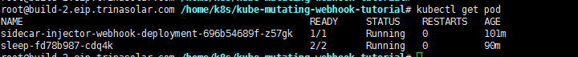
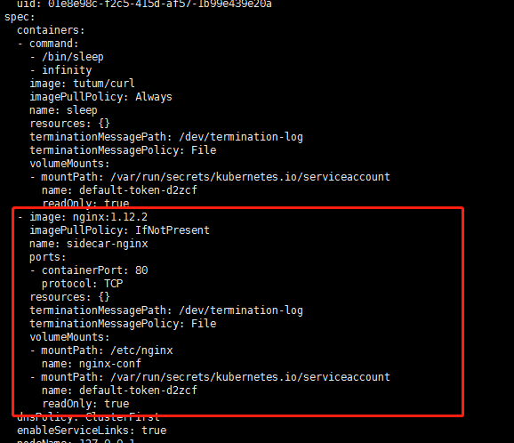

# Webhook
dynamic admission webhook的webhook功能提供用户自定义API验证或修改能力。早先的Initializer能力已经归并到webook。   
它通过MutatingWebhookConfiguration来配置要对那些API对象进行验证和修改，而不需要我们自己用informer去listwatch API对象。  

API-Server自带的admission controller有很多，比如：  
AlwaysPullImages：用于修改pull image policy为always，限制同一node上的image被盗用。  
DefaultStorageClass： 设置pvc的默认storageclass。  
ResourceQuota： 限制配额控制器。  

自定义的admission webhook它主要包括两种：  
MutatingAdmissionWebhook：主要是修改api对象，主要用于sidecar，设置quota等  
ValidatingAdmissionWebhook：验证API对象  

## 使用webhook
例子的完整代码：[https://github.com/yansunkai/kube-mutating-webhook-tutorial](https://github.com/yansunkai/kube-mutating-webhook-tutorial)

首先可以定义MutatingWebhookConfiguration对那些API使用哪个webhook（通过service name来配置）
```yaml
apiVersion: admissionregistration.k8s.io/v1beta1
kind: MutatingWebhookConfiguration
metadata:
  name: sidecar-injector-webhook-cfg
  labels:
    app: sidecar-injector
webhooks:
  - name: sidecar-injector.morven.me
    clientConfig:
      service:
        name: sidecar-injector-webhook-svc
        namespace: default
        path: "/mutate"
      caBundle: ${CA_BUNDLE}
    rules:
      - operations: [ "CREATE" ]
        apiGroups: [""]
        apiVersions: ["v1"]
        resources: ["pods"]
    namespaceSelector:
      matchLabels:
        sidecar-injector: enabled
```
webhooks.clientConfig.service：定义为webhook的service name，path为监听的mux path  
webhooks.rules：规定哪些API做哪些动作时要调用此webhook  
webhooks.namespaceSelector：定义哪个namespace里面的api对象适用  
webhooks.clientConfig.caBundle：因为api server和webhook是通过https通信的，所以要把服务器webhook证书设置为可信，因此我们把ca证书设置给apiserver。  
一般我们都是通过CertificateSigningRequest来请求集群的webhook正式的，所以caBundle就可以设置为apiserver的ca正式，可以通过以后命令获取。  
```jshelllanguage
kubectl config view --raw --minify --flatten
```
具体key的生成，正式请求，secret创建可以参考[link](https://github.com/yansunkai/kube-mutating-webhook-tutorial/blob/master/deployment/webhook-create-signed-cert.sh)

### 编写webhook代码
webhook其实就是一个http service，“/mutate”对应的handler就是处理apiserver请求过来的api对象。  
然后和编写Initializer一样，把sidecar容器的containers字段和volume字段merge到pod，然后返回给apiserver。  

tls设置为上面获取到的证书和对应的服务端秘钥， 然后监听443端口，/mutate对应到serve处理具体的api对象逻辑。  
```go
func main() {
	var parameters webhook.WhSvrParameters

	// get command line parameters
	flag.IntVar(&parameters.Port, "port", 443, "Webhook server port.")
	flag.StringVar(&parameters.CertFile, "tlsCertFile", "/etc/webhook/certs/cert.pem", "File containing the x509 Certificate for HTTPS.")
	flag.StringVar(&parameters.KeyFile, "tlsKeyFile", "/etc/webhook/certs/key.pem", "File containing the x509 private key to --tlsCertFile.")
	flag.StringVar(&parameters.SidecarCfgFile, "sidecarCfgFile", "/etc/webhook/config/sidecarconfig.yaml", "File containing the mutation configuration.")
	flag.Parse()
	
	sidecarConfig, err := webhook.LoadConfig(parameters.SidecarCfgFile)
	if err != nil {
		glog.Errorf("Filed to load configuration: %v", err)
	}
	
	pair, err := tls.LoadX509KeyPair(parameters.CertFile, parameters.KeyFile)
	if err != nil {
		glog.Errorf("Filed to load key pair: %v", err)
	}
	
	whsvr := &webhook.WebhookServer {
		SidecarConfig:    sidecarConfig,
		Server:           &http.Server {
			Addr:        fmt.Sprintf(":%v", parameters.Port),
			TLSConfig:   &tls.Config{Certificates: []tls.Certificate{pair}},
		},
	}
	
	// define http server and server handler
	mux := http.NewServeMux()
	mux.HandleFunc("/mutate", whsvr.Serve)
	whsvr.Server.Handler = mux
	
	// start webhook server in new rountine
	go func() {
		if err := whsvr.Server.ListenAndServeTLS("", ""); err != nil {
			glog.Errorf("Filed to listen and serve webhook server: %v", err)
		}
	}()
	
	// listening OS shutdown singal
	signalChan := make(chan os.Signal, 1)
	signal.Notify(signalChan, syscall.SIGINT, syscall.SIGTERM)
	<-signalChan
	
	glog.Infof("Got OS shutdown signal, shutting down wenhook server gracefully...")
	whsvr.Server.Shutdown(context.Background())
}
```

apiserver发送的是post正文为AdmissionReview序列化的json格式的请求，所以serve把body序列化为AdmissionReview，然后由mutate函数处理。  
```go
func (whsvr *WebhookServer) Serve(w http.ResponseWriter, r *http.Request) {
	var body []byte
	if r.Body != nil {
		if data, err := ioutil.ReadAll(r.Body); err == nil {
			body = data
		}
	}
	if len(body) == 0 {
		glog.Error("empty body")
		http.Error(w, "empty body", http.StatusBadRequest)
		return
	}

	// verify the content type is accurate
	contentType := r.Header.Get("Content-Type")
	if contentType != "application/json" {
		glog.Errorf("Content-Type=%s, expect application/json", contentType)
		http.Error(w, "invalid Content-Type, expect `application/json`", http.StatusUnsupportedMediaType)
		return
	}

	var admissionResponse *v1beta1.AdmissionResponse
	ar := v1beta1.AdmissionReview{}
	if _, _, err := deserializer.Decode(body, nil, &ar); err != nil {
		glog.Errorf("Can't decode body: %v", err)
		admissionResponse = &v1beta1.AdmissionResponse {
			Result: &metav1.Status {
				Message: err.Error(),
			},
		}
	} else {
		admissionResponse = whsvr.mutate(&ar)
	}

	admissionReview := v1beta1.AdmissionReview{}
	if admissionResponse != nil {
		admissionReview.Response = admissionResponse
		if ar.Request != nil {
			admissionReview.Response.UID = ar.Request.UID
		}
	}

	resp, err := json.Marshal(admissionReview)
	if err != nil {
		glog.Errorf("Can't encode response: %v", err)
		http.Error(w, fmt.Sprintf("could not encode response: %v", err), http.StatusInternalServerError)
	}
	glog.Infof("Ready to write reponse ...")
	if _, err := w.Write(resp); err != nil {
		glog.Errorf("Can't write response: %v", err)
		http.Error(w, fmt.Sprintf("could not write response: %v", err), http.StatusInternalServerError)
	}
}
```

AdmissionReview获取request字段，然后解码为pod和sidecar进行merge，最后构建AdmissionResponse给admissionReview返回数据。  
中间是验证是否已经webhook处理过和是否需要webhook处理都是通过annotation来完成的，这里面kube-sytem和kube-public两个namespace下的pod我们也不处理。  
```go
func (whsvr *WebhookServer) mutate(ar *v1beta1.AdmissionReview) *v1beta1.AdmissionResponse {
	req := ar.Request
	var pod corev1.Pod
	if err := json.Unmarshal(req.Object.Raw, &pod); err != nil {
		glog.Errorf("Could not unmarshal raw object: %v", err)
		return &v1beta1.AdmissionResponse {
			Result: &metav1.Status {
				Message: err.Error(),
			},
		}
	}

	glog.Infof("AdmissionReview for Kind=%v, Namespace=%v Name=%v (%v) UID=%v patchOperation=%v UserInfo=%v",
		req.Kind, req.Namespace, req.Name, pod.Name, req.UID, req.Operation, req.UserInfo)
	
	// determine whether to perform mutation
	if !mutationRequired(ignoredNamespaces, &pod.ObjectMeta) {
		glog.Infof("Skipping mutation for %s/%s due to policy check", pod.Namespace, pod.Name)
		return &v1beta1.AdmissionResponse {
			Allowed: true, 
		}
	}
	
	// Workaround: https://github.com/kubernetes/kubernetes/issues/57982
	applyDefaultsWorkaround(whsvr.SidecarConfig.Containers, whsvr.SidecarConfig.Volumes)
	annotations := map[string]string{admissionWebhookAnnotationStatusKey: "injected"}
	patchBytes, err := createPatch(&pod, whsvr.SidecarConfig, annotations)
	if err != nil {
		return &v1beta1.AdmissionResponse {
			Result: &metav1.Status {
				Message: err.Error(),
			},
		}
	}
	
	glog.Infof("AdmissionResponse: patch=%v\n", string(patchBytes))
	return &v1beta1.AdmissionResponse {
		Allowed: true,
		Patch:   patchBytes,
		PatchType: func() *v1beta1.PatchType {
			pt := v1beta1.PatchTypeJSONPatch
			return &pt
		}(),
	}
}
```


### 效果
sidecar容器为nginx:1.12.2
````go
apiVersion: v1
kind: ConfigMap
metadata:
  name: sidecar-injector-webhook-configmap
data:
  sidecarconfig.yaml: |
    containers:
      - name: sidecar-nginx
        image: nginx:1.12.2
        imagePullPolicy: IfNotPresent
        ports:
          - containerPort: 80
        volumeMounts:
          - name: nginx-conf
            mountPath: /etc/nginx
    volumes:
      - name: nginx-conf
        configMap:
          name: nginx-configmap
````
我们部署一个sleep pod，里面跑了2个容器，其中一个就是nginx:1.12.2的sidecar容器。  
  

