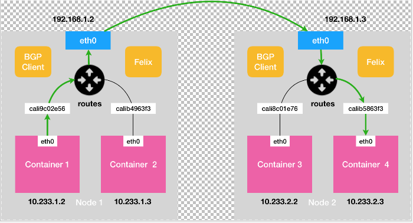
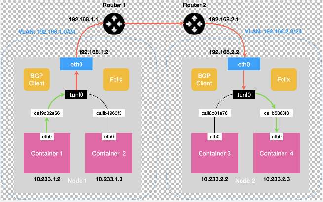

# Calico
Calico的网络方案和Flannel的host-gw模式的原理是一样的，都是通过路由吓一跳的方式来连通容器网络，
只不过Calico维护路由表的方式是通过BGP（Border Gateway Protocol）边界路由协议来维护的。  
而且Calico可以通过开启IPIP模式，通过封装IP包来达到VM二层网络不可达时的通信。  

## 一般模式：
 
calico并不会创建cni网桥，它为容器创建的Veth Pair设备的另外一段直接放在宿主机上，这样容器的IP包通过eth0发出后就直接来到
宿主机的网络栈，然后就直接根据宿主机上的路由表通过eth0发送到下一跳也就是目标宿主机，然后再通过直连路由发送给calib5863f3来到目标容器。  
这里面核心的吓一跳路由规则就是Calico的一个组件Felix维护的，这些路由信息通过BGP Client通过BGP协议来传输。  
这样就可以看出Calico主要的组件有：  
CNI插件： 实现kubernetes的CNI接口。  
Felix： 以DaemonSet形式部署，负责宿主机路由规则维护。  
BIRD： BGP协议的client，负责在集群中分发路由规则。  

### Node-to-Node Mesh模式
在Calico的网络集群中每个host就是一个BGP Peer，我们称为Node-to-Node Mesh模式。这种模式下集群规模增大时，
由于每个节点都要通信所以网络压力会指数级增长，所以就是Route Reflector模式。

### Route Reflector模式
这种模式是指定集群中几个节点专门负责BGP连接来学习路由规则，而其他节点只需要和这几个节点交换路由信息就可以获得整个集群的路由信息。  
这就模式就可以把网络压力很好的控制在N的数量级上，而不会指数级增长。

### IPIP模式
上面介绍了IPIP可以解决二层网络不可达时的容器通信，具体实现就是如下图。
 
首先calico会在宿主机上增加如下路由，tunl0是一个IP隧道设备，不是之前flannel UDP模式里的tun0。  
IP包进入tunl0后，linux内核的IPIP驱动会将IP包进行封包，做为宿主机网络IP包的Payload，这样宿主机就通过它的三层网络来传输IP包，
这样IP包就能通过三层网络到达目标宿主机也就是192.168.2.2，Node2也是通过IPIP来解包，然后通过路由规则发送到目标容器。  
```bash
10.233.2.0/24 via 192.168.2.2 tunl0
```
IPIP模式也有封包解包的行为，所以它的性能和Flannel的Vxlan模式差不多。

在三层网络模型中，其实我们可以通过宿主机的中间路由如Router1 Router2也加入到BGP网络来学习路由规则，这样就可以通过
Node1-> Router1 -> Router2 ->Node2这样的路由规则实现二层转发。避免开启IPIP模式。  
但是在公有云网络的，这种中间路由是不可控的所以这种模式一般在私有云环境中使用。  

