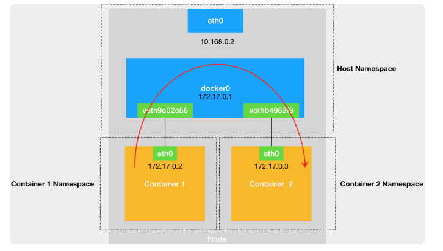
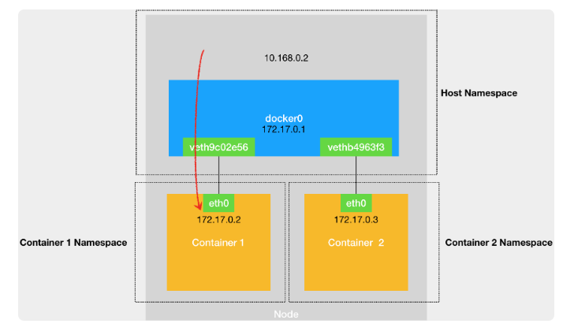
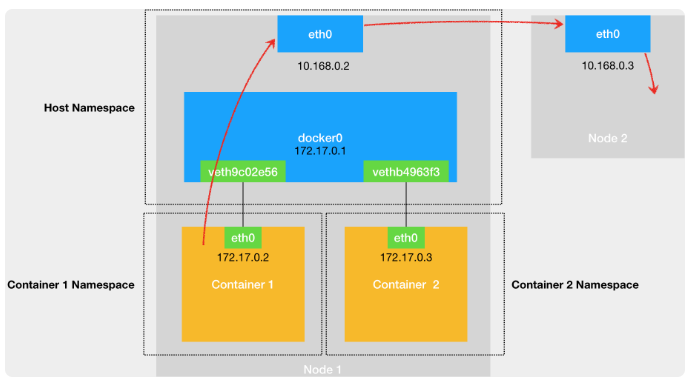

# 一台宿主机上的容器相互通信
默认情况下Docker启动的容器在一台宿主机上都是通过docker0网桥相互连接通信的。  
*当然也可以指定 -net=host和宿主机共享网络栈  
*网络栈被namespace隔离的包括：网卡（Network Interface） 回环设备（Loopback Device） 路由表（Routing Table） iptables规则（netfilter）  

启动nginx容器，容器中安装ifconfig 和 route命令
```bash
docker run -d --name nginx-1 nginx
```

在容器中可以看到，docker为容器创建了eth0网卡，它是一个Veth Pair设备。  
网段是172.17.0.0/16， 这个网段的路由规则是gateway=0.0.0.0表示直连规则。
```bash
# 在宿主机上
$ docker exec -it nginx-1 /bin/bash
# 在容器里
root@2b3c181aecf1:/# ifconfig
eth0: flags=4163<UP,BROADCAST,RUNNING,MULTICAST>  mtu 1500
        inet 172.17.0.2  netmask 255.255.0.0  broadcast 0.0.0.0
        inet6 fe80::42:acff:fe11:2  prefixlen 64  scopeid 0x20<link>
        ether 02:42:ac:11:00:02  txqueuelen 0  (Ethernet)
        RX packets 364  bytes 8137175 (7.7 MiB)
        RX errors 0  dropped 0  overruns 0  frame 0
        TX packets 281  bytes 21161 (20.6 KiB)
        TX errors 0  dropped 0 overruns 0  carrier 0  collisions 0
        
lo: flags=73<UP,LOOPBACK,RUNNING>  mtu 65536
        inet 127.0.0.1  netmask 255.0.0.0
        inet6 ::1  prefixlen 128  scopeid 0x10<host>
        loop  txqueuelen 1000  (Local Loopback)
        RX packets 0  bytes 0 (0.0 B)
        RX errors 0  dropped 0  overruns 0  frame 0
        TX packets 0  bytes 0 (0.0 B)
        TX errors 0  dropped 0 overruns 0  carrier 0  collisions 0
        
$ route
Kernel IP routing table
Destination     Gateway         Genmask         Flags Metric Ref    Use Iface
default         172.17.0.1      0.0.0.0         UG    0      0        0 eth0
172.17.0.0      0.0.0.0         255.255.0.0     U     0      0        0 eth0
```

在宿主机上查看网络可以看到，Veth Pair设备的另一段在宿主机上并且连接到了docker0。
```bash
# 在宿主机上
$ ifconfig
...
docker0   Link encap:Ethernet  HWaddr 02:42:d8:e4:df:c1  
          inet addr:172.17.0.1  Bcast:0.0.0.0  Mask:255.255.0.0
          inet6 addr: fe80::42:d8ff:fee4:dfc1/64 Scope:Link
          UP BROADCAST RUNNING MULTICAST  MTU:1500  Metric:1
          RX packets:309 errors:0 dropped:0 overruns:0 frame:0
          TX packets:372 errors:0 dropped:0 overruns:0 carrier:0
 collisions:0 txqueuelen:0 
          RX bytes:18944 (18.9 KB)  TX bytes:8137789 (8.1 MB)
veth9c02e56 Link encap:Ethernet  HWaddr 52:81:0b:24:3d:da  
          inet6 addr: fe80::5081:bff:fe24:3dda/64 Scope:Link
          UP BROADCAST RUNNING MULTICAST  MTU:1500  Metric:1
          RX packets:288 errors:0 dropped:0 overruns:0 frame:0
          TX packets:371 errors:0 dropped:0 overruns:0 carrier:0
 collisions:0 txqueuelen:0 
          RX bytes:21608 (21.6 KB)  TX bytes:8137719 (8.1 MB)
          
$ brctl show
bridge name bridge id  STP enabled interfaces
docker0  8000.0242d8e4dfc1 no  veth9c02e56
```

然后再启动一个nginx-2容器，它的Veth Pair设备的一端也在docker0网桥上。
```bash
docker run -d --name nginx-2 nginx
$ brctl show
bridge name bridge id  STP enabled interfaces
docker0  8000.0242d8e4dfc1 no  veth9c02e56
       vethb4963f3
```

然后他们的通信过程可以用这个图表示：
 

nginx-1访问nginx2（172.17.0.3），匹配nginx-1中的第二条路由规则，而且是直连规则，直接通过eth0发送ARP广播，ARP广播包就到docker0网桥，
而docker0网桥是二层设备就广播ARP包，然后nginx2收到广播包回复mac地址。   
然后nginx-1就填上mac地址发送数据包，数据包经过eth0来到docker0，docker0通过CAM表，查看到mac地址对应的端口是nginx2的veth pair，这样数据就到达了nginx2的eth0。

## 宿主机访问容器
宿主机访问容器，同样根据路由规则3，数据包到达docker0网桥，然后通过Veth Pair设备对到达nginx-1的eth0。
```bash
root@build-2.eip.trinasolar.com ~# route
Kernel IP routing table
Destination     Gateway         Genmask         Flags Metric Ref    Use Iface
default         gateway         0.0.0.0         UG    0      0        0 eth0
link-local      0.0.0.0         255.255.0.0     U     1002   0        0 eth0
172.17.0.0      0.0.0.0         255.255.0.0     U     0      0        0 docker0
192.168.1.0     0.0.0.0         255.255.255.0   U     0      0        0 eth0
```

 

## 容器访问另外一台宿主机（外网）
首先根据nginx-1中的默认路由1，数据包到达docker0网桥，docker0网桥收到自己的数据包然后就会查看宿主机的路由规则，匹配默认路由通过eth0发送给gateway，接下来就是宿主机直接通信到达另外一台宿主机。
 