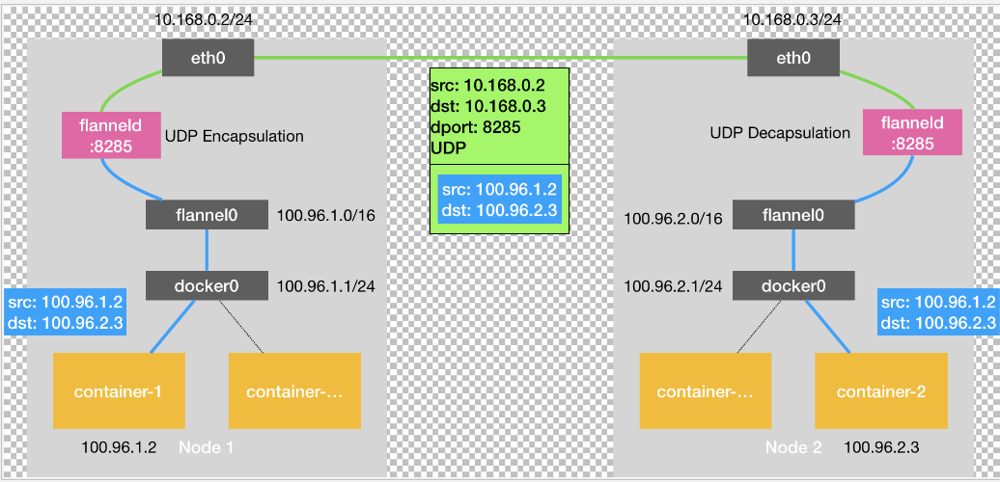
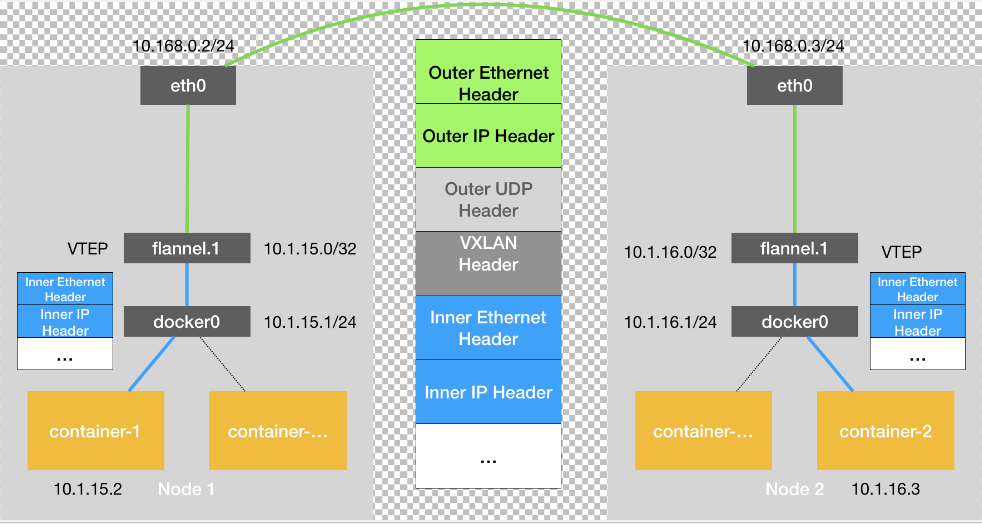
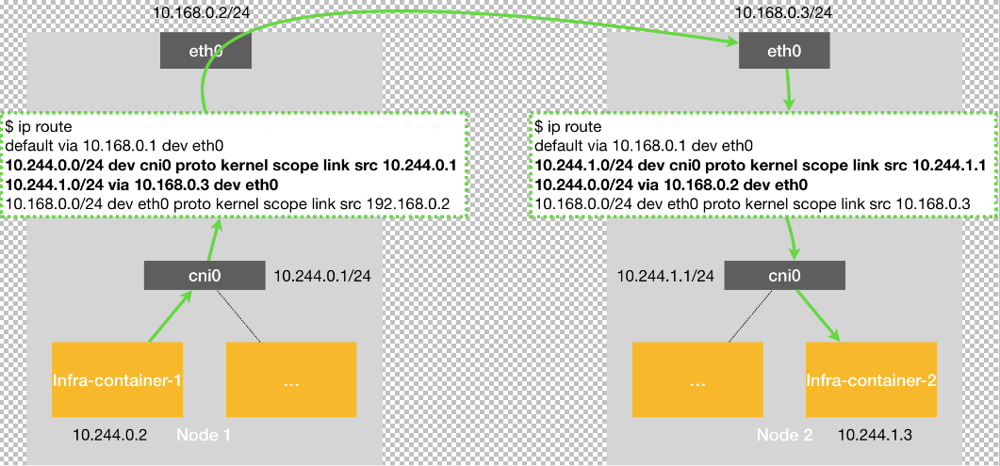

# Flannel
kubernetes默认集群中的容器都是直接连通的，而如何连通kubernetes没有具体实现，需要网络插件来实现容器跨主机连通，Flannel就是其中之一。  
Flannel有三种实现：VXLAN，HOST-GW，UDP。

## UDP模式
 
container1访问container2的数据包源地址：100.96.1.2 目标地址：100.96.2.3。  
根据容器内的路由规则，数据包来到docker0网桥，然后查看宿主机路由规则。  
flannel会在宿主机上维护下面一套路由规则  
```bash
# 在 Node 1 上
$ ip route
default via 10.168.0.1 dev eth0
100.96.0.0/16 dev flannel0  proto kernel  scope link  src 100.96.1.0
100.96.1.0/24 dev docker0  proto kernel  scope link  src 100.96.1.1
10.168.0.0/24 dev eth0  proto kernel  scope link  src 10.168.0.2
```
然后我们的数据包匹配第二条路由规则，发送给flannel0的设备。  
flannel0是个tunnel设备，tunnel设备会把数据包从内核态发送用户态的应用程序。  
这样数据包就交给flanneld进程处理。  
flanneld会维护一个Subnet，把集群中所有容器的subnet和宿主机关系存储在etcd中，然后查询etcd找到目标地址100.96.2.3对应
子网100.96.2.0/24的宿主机10.168.0.3，然后把数据包封包成源地址：10.168.0.2 目标地址：10.168.0.3的udp包，发送给8285端口，也就是
node2的flanneld进程，然后node2的flanneld进程解包，把里面的原始包发送给flannel0，然后根据路由最终到达container2。  
这里面的subnet可以通过docker的参数bid设置。  
* 这里面的udp丢包并没有关系因为是中间过程，丢包重试等通过外层的tcp等协议实现。  

因为udp的封包解包涉及到内核态和用户态的数据拷贝，所以效率比较低，性能较差，所以用vxlan模式代替。  

## Vxlan模式
VXLAN主要是通过VTEP（VXLAN Tunnel End Point）设备，所有连接到这个设备的docker或者vm都是二层连通的，就像在一个LAN里面。  
 
和udp模式一样，container-1发出去的包到达docker0网桥然后会被路由到flannel.1设备，flannel.1设备就是VTEP设备，
这样数据包就到达了二层网络的一个口，这时候vxlan就负责把它发送到另外一台机器的VTEP设备，这样就达到跨主机通信的目的。  
具体怎么工作：  
首先每台集群的机器都运行着flanneld进程，每当VM加入集群就会在前VM添加如下路由规则，比如node2加入后：  
```bash
route -n
Kernel IP routing table
Destination     Gateway         Genmask         Flags Metric Ref    Use Iface
...
10.1.16.0       10.1.16.0       255.255.255.0   UG    0      0        0 flannel.1
```
就是发往node2容器的包要经过flannel.1发往10.1.16.0的gateway，也就是node2的VTEP设备。  
这时候就需要把node2的VTEP的mac地址填上（VTEP是具有mac地址的），又是flanneld进程，它会维护一个ARP记录，
这样就可以封一个二层包发送给node1的VTEP设备（flannel.1）了。  
而这其实只是一个内部数据帧，在宿主机中并不能传输，这时候其实就是在内核封一个udp包来传输的。  
```bash
# 在 Node 1 上
$ ip neigh show dev flannel.1
10.1.16.0 lladdr 5e:f8:4f:00:e3:37 PERMANENT
```
如何封udp包：  
为了表明是Vxlan的数据帧，会在外面加一个VXLAN Header，其中有个VNI标记，一般为1，表明这个包是flannel.1的VETP设备处理。     
又是flanneld它维护一个FDB（Forwarding Database）数据库， 这样node1上的flannel.1就知道应该把包发给10.168.0.3，
而这正是node2主机，然后进行封包，即Outer IP Header为10.168.0.3，并且填上Node2的mac地址，而这个MAC地址NODE1本身会维护ARP表。  
这样一个数据包就封形成了，就流程中间那个数据包。  
```bash
# 在 Node 1 上，使用“目的 VTEP 设备”的 MAC 地址进行查询
$ bridge fdb show flannel.1 | grep 5e:f8:4f:00:e3:37
5e:f8:4f:00:e3:37 dev flannel.1 dst 10.168.0.3 self permanent
```
这样flannel.1就会把数据包从Node1的eth0发出去，到达Node2的eth0，然后网络栈解包发现是VXLAN包，就发给node2的flannel.1处理
接着拆出原始包，根据路由进入docker0，然后到容器内。  

## HOST_GW模式
其实我们可以通过配置路由规则，一跳跳的跳到夸主机容器。这就是HOST_GW原理。
 
node1的容器1访问node2的容器2，数据包到达cni0（docker0）后，首先根据下面路由规则，从eth0就会发往node2的eth0。  
```bash
10.244.1.0/24 via 10.168.0.3 dev eth0
```
到达node2的数据包根据这条直接路由，经过cni0网桥到达容器2。 
```bash
10.244.1.0/24 dev cni0 proto kernel scope link src 10.244.1.1
```
也就是说flannel会维护一套subnet的下一跳路由为该subnet对应的宿主机IP，也就是host充当了gateway。  
flanneld把subnet和host信息保存在etcd，然后flanneld watch数据变化维护路由表。  

在 Kubernetes v1.7 之后，类似 Flannel、Calico 的 CNI 网络插件都是可以直接连接Kubernetes 的 APIServer 来访问Etcd 的，
无需额外部署 Etcd 给它们使用。    

这种路由无需封解包，性能会优于vxlan模式。 但是由于是通过路由下一跳，通过mac地址来到达目的宿主机的，
所以需要保证集群VM是二层网络连通的。   
而且根据集群数量的增多，维护的路由规则会倍数增长，所以这总模式之适合小的集群使用，
一种更加高效的路由表维护方式是Calico项目的BGP。