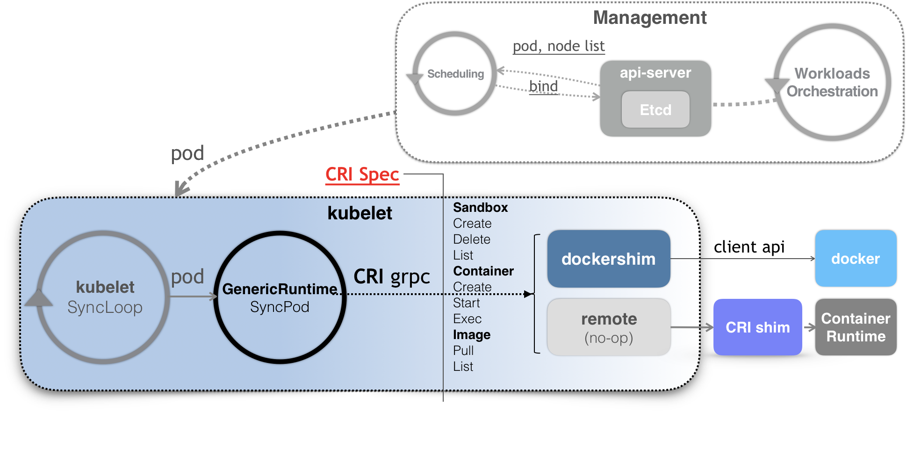
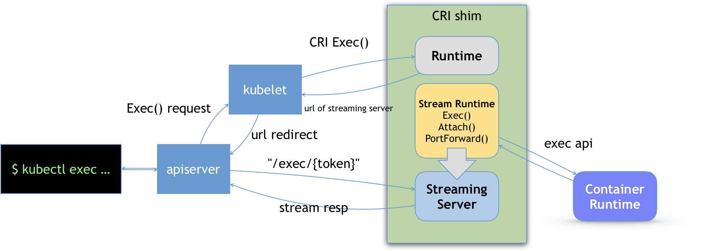

# CRI
下面这个就是整个POD的调度过程。可以看到容器的创建最终都是通过CRI grpc调用，CRI shim（dockershim）响应请求。
shim的作用就是把上层CRI接口调用传递给具体docker或者其他容器运行时系统，最终调用linux操作namespace，cgroups等操作。  
  

## CRI接口定义
CRI接口定义主要由RuntimeService，ImageManagerService组成。  
路径：kubernetes\staging\src\k8s.io\cri-api\pkg\apis\services.go  
```go
type RuntimeService interface {
	RuntimeVersioner
	ContainerManager
	PodSandboxManager
	ContainerStatsManager

	// UpdateRuntimeConfig updates runtime configuration if specified
	UpdateRuntimeConfig(runtimeConfig *runtimeapi.RuntimeConfig) error
	// Status returns the status of the runtime.
	Status() (*runtimeapi.RuntimeStatus, error)
}
```

```go
type ImageManagerService interface {
	// ListImages lists the existing images.
	ListImages(filter *runtimeapi.ImageFilter) ([]*runtimeapi.Image, error)
	// ImageStatus returns the status of the image.
	ImageStatus(image *runtimeapi.ImageSpec) (*runtimeapi.Image, error)
	// PullImage pulls an image with the authentication config.
	PullImage(image *runtimeapi.ImageSpec, auth *runtimeapi.AuthConfig, podSandboxConfig *runtimeapi.PodSandboxConfig) (string, error)
	// RemoveImage removes the image.
	RemoveImage(image *runtimeapi.ImageSpec) error
	// ImageFsInfo returns information of the filesystem that is used to store images.
	ImageFsInfo() ([]*runtimeapi.FilesystemUsage, error)
}
```
ImageManagerService非常简单,就是各个方法的字面意思。  

而RuntimeService里面有个PodSandboxManager，这个接口定义主要是对kubernetes里面的pod对象的一个抽象，它抽取了pod对象和容器运行时相关的字段进行操作。  
```go
type PodSandboxManager interface {
	// RunPodSandbox creates and starts a pod-level sandbox. Runtimes should ensure
	// the sandbox is in ready state.
	RunPodSandbox(config *runtimeapi.PodSandboxConfig, runtimeHandler string) (string, error)
	// StopPodSandbox stops the sandbox. If there are any running containers in the
	// sandbox, they should be force terminated.
	StopPodSandbox(podSandboxID string) error
	// RemovePodSandbox removes the sandbox. If there are running containers in the
	// sandbox, they should be forcibly removed.
	RemovePodSandbox(podSandboxID string) error
	// PodSandboxStatus returns the Status of the PodSandbox.
	PodSandboxStatus(podSandboxID string) (*runtimeapi.PodSandboxStatus, error)
	// ListPodSandbox returns a list of Sandbox.
	ListPodSandbox(filter *runtimeapi.PodSandboxFilter) ([]*runtimeapi.PodSandbox, error)
	// PortForward prepares a streaming endpoint to forward ports from a PodSandbox, and returns the address.
	PortForward(*runtimeapi.PortForwardRequest) (*runtimeapi.PortForwardResponse, error)
}
```
而具体的业务容器操作接口是ContainerManager  
```go
type ContainerManager interface {
	// CreateContainer creates a new container in specified PodSandbox.
	CreateContainer(podSandboxID string, config *runtimeapi.ContainerConfig, sandboxConfig *runtimeapi.PodSandboxConfig) (string, error)
	// StartContainer starts the container.
	StartContainer(containerID string) error
	// StopContainer stops a running container with a grace period (i.e., timeout).
	StopContainer(containerID string, timeout int64) error
	// RemoveContainer removes the container.
	RemoveContainer(containerID string) error
	// ListContainers lists all containers by filters.
	ListContainers(filter *runtimeapi.ContainerFilter) ([]*runtimeapi.Container, error)
	// ContainerStatus returns the status of the container.
	ContainerStatus(containerID string) (*runtimeapi.ContainerStatus, error)
	// UpdateContainerResources updates the cgroup resources for the container.
	UpdateContainerResources(containerID string, resources *runtimeapi.LinuxContainerResources) error
	// ExecSync executes a command in the container, and returns the stdout output.
	// If command exits with a non-zero exit code, an error is returned.
	ExecSync(containerID string, cmd []string, timeout time.Duration) (stdout []byte, stderr []byte, err error)
	// Exec prepares a streaming endpoint to execute a command in the container, and returns the address.
	Exec(*runtimeapi.ExecRequest) (*runtimeapi.ExecResponse, error)
	// Attach prepares a streaming endpoint to attach to a running container, and returns the address.
	Attach(req *runtimeapi.AttachRequest) (*runtimeapi.AttachResponse, error)
	// ReopenContainerLog asks runtime to reopen the stdout/stderr log file
	// for the container. If it returns error, new container log file MUST NOT
	// be created.
	ReopenContainerLog(ContainerID string) error
}
```

例如：底层runtime是docker，然后我们run一个foo的pod里面包含A，B两个容器看看具体CRI是如何调用的。  
1.首先调用RunPodSandbox接口，而dockershim的话会调用docker api创建名为foo的infra容器。  
2.然后调用CreateContainer接口创建A容器  
3.调用StartContainer接口启动A容器  
4.然后调用CreateContainer接口创建B容器  
5.调用StartContainer接口启动B容器  

infra容器的作用是：主要是为pod里面的容器设置共享的namespace，挂在volume等操作。  

### Streaming API（exec，log）
exec，log等操作是通过与CRI shim建立长连接来维护数据的。
  
1.首先API server通过kubelet发起CRI的Exec调用，然后CRI shim返回URL（streaming server地址和端口）
2.api server通过返回的URL建立长连接，然后进行通信。