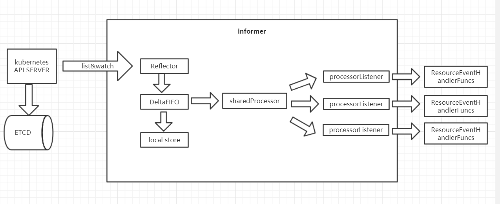

# SharedInformer
我们知道创建[Informer](./informer.md)时会为每个Informer创建一个Store来存放API对象缓存，
而Kubernetes中运行有很多控制器，这些控制器很有可能对同个资源进行管理，所以很自然的就会想到共享缓存。  

SharedInformer就是创建一份供多个控制器共享的缓存。这样就不需要重复缓存资源，减少内存开销。
同时不管有多少个控制器同时读取事件，SharedInformer只会调用一个Watch API来watch上游的API Server，大大降低了API Server的负载。

## informer代码解析
从下面的代码中可以看到，SharedInformer是通过AddEventHandler方法添加ResourceEventHandlerFuncs，所以一个SharedInformer可以被多个控制器循环共用。
一般我们会提供一个Workqueue用于同步informer和控制器循环之间的数据。
kubernetes提供了很多种Workqueue分别有延迟队列，定时队列和速率限制队列。可以通过client-go/util/workqueue目录查看。
```go
    restClient := clientset.AppsV1beta1().RESTClient()
	watchlist := cache.NewListWatchFromClient(restClient, "deployments", corev1.NamespaceAll, fields.Everything())
	controller.informer = cache.NewSharedInformer(watchlist, &v1beta1.Deployment{}, resyncPeriod)
	controller.queue = workqueue.NewRateLimitingQueue(workqueue.DefaultControllerRateLimiter())
	
	controller.informer.AddEventHandler(cache.ResourceEventHandlerFuncs{
    	AddFunc: controller.enqueueNetwork,
    	UpdateFunc: func(old, new interface{}) {
    		oldNetwork := old.(*samplecrdv1.Network)
    		newNetwork := new.(*samplecrdv1.Network)
    		if oldNetwork.ResourceVersion == newNetwork.ResourceVersion {
    			// Periodic resync will send update events for all known Networks.
    			// Two different versions of the same Network will always have different RVs.
    			return
    		}
    		controller.enqueueNetwork(new)
    	},
    	DeleteFunc: controller.enqueueNetworkForDelete,
    })
	stop := make(chan struct{})
	controller.informer.Run(stop)
```

NewSharedInformer返回SharedInformer，结构体中的indexer就是本地缓存store。
#### NewSharedInformer
```go
func NewSharedInformer(lw ListerWatcher, objType runtime.Object, resyncPeriod time.Duration) SharedInformer {
	return NewSharedIndexInformer(lw, objType, resyncPeriod, Indexers{})
}
```
#### NewSharedIndexInformer
```go
func NewSharedIndexInformer(lw ListerWatcher, objType runtime.Object, defaultEventHandlerResyncPeriod time.Duration, indexers Indexers) SharedIndexInformer {
	realClock := &clock.RealClock{}
	sharedIndexInformer := &sharedIndexInformer{
		processor:                       &sharedProcessor{clock: realClock},
		indexer:                         NewIndexer(DeletionHandlingMetaNamespaceKeyFunc, indexers),
		listerWatcher:                   lw,
		objectType:                      objType,
		resyncCheckPeriod:               defaultEventHandlerResyncPeriod,
		defaultEventHandlerResyncPeriod: defaultEventHandlerResyncPeriod,
		cacheMutationDetector:           NewCacheMutationDetector(fmt.Sprintf("%T", objType)),
		clock:                           realClock,
	}
	return sharedIndexInformer
}
```
sharedIndexInformer.Run函数内部给我们创建了一个controller对象，这个controller对象和cache.NewInformer返回的controller是一样的，
通过上篇informer的分析我们知道，controller.run会运行Reflector.run，然后ListAndWatch API对象放入DeltaQueue队列，
然后pop出API对象给Config.Process消费，也就是这里的s.HandleDeltas。
#### (s *sharedIndexInformer) Run
```go
func (s *sharedIndexInformer) Run(stopCh <-chan struct{}) {
	defer utilruntime.HandleCrash()

	fifo := NewDeltaFIFO(MetaNamespaceKeyFunc, s.indexer)

	cfg := &Config{
		Queue:            fifo,
		ListerWatcher:    s.listerWatcher,
		ObjectType:       s.objectType,
		FullResyncPeriod: s.resyncCheckPeriod,
		RetryOnError:     false,
		ShouldResync:     s.processor.shouldResync,

		Process: s.HandleDeltas,
	}

	func() {
		s.startedLock.Lock()
		defer s.startedLock.Unlock()

		s.controller = New(cfg)
		s.controller.(*controller).clock = s.clock
		s.started = true
	}()

	// Separate stop channel because Processor should be stopped strictly after controller
	processorStopCh := make(chan struct{})
	var wg wait.Group
	defer wg.Wait()              // Wait for Processor to stop
	defer close(processorStopCh) // Tell Processor to stop
	wg.StartWithChannel(processorStopCh, s.cacheMutationDetector.Run)
	wg.StartWithChannel(processorStopCh, s.processor.run)

	defer func() {
		s.startedLock.Lock()
		defer s.startedLock.Unlock()
		s.stopped = true // Don't want any new listeners
	}()
	s.controller.Run(stopCh)
}
```

HandleDeltas的处理同样先更新本地缓存store，然后调用s.processor.distribute。
#### HandleDeltas
```go
func (s *sharedIndexInformer) HandleDeltas(obj interface{}) error {
	s.blockDeltas.Lock()
	defer s.blockDeltas.Unlock()

	// from oldest to newest
	for _, d := range obj.(Deltas) {
		switch d.Type {
		case Sync, Added, Updated:
			isSync := d.Type == Sync
			s.cacheMutationDetector.AddObject(d.Object)
			if old, exists, err := s.indexer.Get(d.Object); err == nil && exists {
				if err := s.indexer.Update(d.Object); err != nil {
					return err
				}
				s.processor.distribute(updateNotification{oldObj: old, newObj: d.Object}, isSync)
			} else {
				if err := s.indexer.Add(d.Object); err != nil {
					return err
				}
				s.processor.distribute(addNotification{newObj: d.Object}, isSync)
			}
		case Deleted:
			if err := s.indexer.Delete(d.Object); err != nil {
				return err
			}
			s.processor.distribute(deleteNotification{oldObj: d.Object}, false)
		}
	}
	return nil
}
```

这里迭代出来的每个listener就是对EventHandler的一个封装，最终在processorListener.run函数中调用每个控制器注册进来的ResourceEventHandlerFuncs。
#### (p *sharedProcessor) distribute
```go
func (p *sharedProcessor) distribute(obj interface{}, sync bool) {
	p.listenersLock.RLock()
	defer p.listenersLock.RUnlock()

	if sync {
		for _, listener := range p.syncingListeners {
			listener.add(obj)
		}
	} else {
		for _, listener := range p.listeners {
			listener.add(obj)
		}
	}
}
```
#### (p *processorListener) add
```go
func (p *processorListener) add(notification interface{}) {
	p.addCh <- notification
}
```
#### (p *processorListener) run()
```go
func (p *processorListener) run() {
	// this call blocks until the channel is closed.  When a panic happens during the notification
	// we will catch it, **the offending item will be skipped!**, and after a short delay (one second)
	// the next notification will be attempted.  This is usually better than the alternative of never
	// delivering again.
	stopCh := make(chan struct{})
	wait.Until(func() {
		// this gives us a few quick retries before a long pause and then a few more quick retries
		err := wait.ExponentialBackoff(retry.DefaultRetry, func() (bool, error) {
			for next := range p.nextCh {
				switch notification := next.(type) {
				case updateNotification:
					p.handler.OnUpdate(notification.oldObj, notification.newObj)
				case addNotification:
					p.handler.OnAdd(notification.newObj)
				case deleteNotification:
					p.handler.OnDelete(notification.oldObj)
				default:
					utilruntime.HandleError(fmt.Errorf("unrecognized notification: %T", next))
				}
			}
			// the only way to get here is if the p.nextCh is empty and closed
			return true, nil
		})

		// the only way to get here is if the p.nextCh is empty and closed
		if err == nil {
			close(stopCh)
		}
	}, 1*time.Minute, stopCh)
}
```

sharedProcessor用来保存所有通过AddEventHandler添加的经过封装的processorListener。
```go
type sharedProcessor struct {
	listenersStarted bool
	listenersLock    sync.RWMutex
	listeners        []*processorListener
	syncingListeners []*processorListener
	clock            clock.Clock
	wg               wait.Group
}
```

processorListener是对ResourceEventHandler的一个封装，主要为API对象分发与ResourceEventHandlerFuncs执行提供缓存。
```go
type processorListener struct {
	nextCh chan interface{}
	addCh  chan interface{}

	handler ResourceEventHandler

	// pendingNotifications is an unbounded ring buffer that holds all notifications not yet distributed.
	// There is one per listener, but a failing/stalled listener will have infinite pendingNotifications
	// added until we OOM.
	// TODO: This is no worse than before, since reflectors were backed by unbounded DeltaFIFOs, but
	// we should try to do something better.
	pendingNotifications buffer.RingGrowing

	// requestedResyncPeriod is how frequently the listener wants a full resync from the shared informer
	requestedResyncPeriod time.Duration
	// resyncPeriod is how frequently the listener wants a full resync from the shared informer. This
	// value may differ from requestedResyncPeriod if the shared informer adjusts it to align with the
	// informer's overall resync check period.
	resyncPeriod time.Duration
	// nextResync is the earliest time the listener should get a full resync
	nextResync time.Time
	// resyncLock guards access to resyncPeriod and nextResync
	resyncLock sync.Mutex
}
```

## sharedinformer工作流程图
 